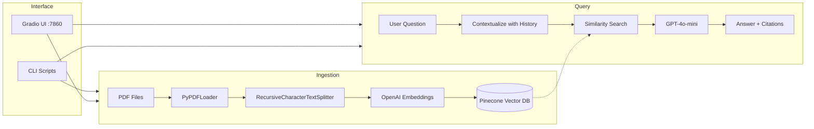

# RAG AI Chatbot with LangChain + Pinecone

A Retrieval-Augmented Generation (RAG) chatbot that ingests PDFs into a Pinecone vector database, retrieves relevant context via semantic search, and generates grounded answers using OpenAI GPT-4o-mini. Supports conversation memory, dual orchestration modes (LangChain LCEL and LangGraph), a Gradio web UI, CLI tools, and Docker deployment.

---

## Table of Contents

- [Architecture](#architecture)
- [How It Works](#how-it-works)
- [Features](#features)
- [Project Structure](#project-structure)
- [Prerequisites](#prerequisites)
- [Setup](#setup)
- [Configuration](#configuration)
- [Usage](#usage)
  - [Ingesting PDFs](#ingesting-pdfs)
  - [Launching the Web UI](#launching-the-web-ui)
  - [CLI Querying](#cli-querying)
  - [Docker](#docker)
- [Orchestration Modes](#orchestration-modes)
- [PDF Ingestion Pipeline Details](#pdf-ingestion-pipeline-details)
- [Prompt Customization](#prompt-customization)
- [Tuning Retrieval Quality](#tuning-retrieval-quality)
- [Re-ingesting and Deduplication](#re-ingesting-and-deduplication)
- [Testing](#testing)
- [Roadmap](#roadmap)
- [License](#license)

---

## Architecture



## How It Works

1. **Ingestion** -- PDFs are loaded page-by-page with `PyPDFLoader`, split into overlapping chunks via `RecursiveCharacterTextSplitter`, embedded with OpenAI `text-embedding-3-small` (1536 dimensions), and upserted into a Pinecone serverless index. Each vector gets a deterministic SHA-256 ID based on `filename::page::chunk_index` so re-ingesting the same file overwrites rather than duplicates.

2. **Query contextualization** -- When a user asks a follow-up question, the system first passes the full chat history and the new question through a contextualization prompt that rewrites the question to be standalone (e.g., "Tell me more" becomes "Tell me more about Retrieval-Augmented Generation").

3. **Retrieval** -- The standalone question is embedded and used to run a cosine similarity search against Pinecone, returning the top-K most relevant chunks along with their metadata (source filename, page number).

4. **Generation** -- The retrieved chunks are injected into a system prompt that instructs GPT-4o-mini to answer based only on the provided context, cite sources with filename and page, and decline gracefully when the context is insufficient.

5. **Memory** -- Conversation history is maintained per session. The LangChain mode uses a windowed in-memory buffer; the LangGraph mode uses a `MemorySaver` checkpointer that persists state per thread automatically.

## Features

- **PDF Knowledge Base** -- Upload and ingest multiple PDFs with intelligent chunking and per-chunk metadata (source, page, chunk index)
- **Semantic Search** -- Pinecone vector database with cosine similarity retrieval and configurable top-K
- **Conversation Memory** -- Chatbot remembers previous questions within a session (configurable window size)
- **Dual Orchestration** -- Switch between LangChain (LCEL) and LangGraph modes at runtime via the UI
- **Source Citations** -- Every answer includes filename and page number references
- **Gradio Web UI** -- Clean interface with model selector, orchestration toggle, top-K slider, and in-browser PDF upload with live ingestion
- **CLI Tools** -- Bulk PDF ingestion script and a headless query script for scripting/testing
- **Docker Ready** -- Dockerfile and docker-compose.yml for containerized deployment
- **Deterministic Deduplication** -- Hash-based vector IDs prevent duplicate vectors when re-ingesting the same PDF
- **Zero-config Index** -- Pinecone index is auto-created on first use if it doesn't exist

## Project Structure

```
rag-ai-chat-bot-with-langchain/
|-- app/
|   |-- __init__.py
|   |-- config.py          # Central settings via pydantic-settings, loads .env
|   |-- ingestion.py       # PDF loading (PyPDFLoader), chunking (RecursiveCharacterTextSplitter), metadata
|   |-- embeddings.py      # OpenAI text-embedding-3-small wrapper (cached singleton)
|   |-- vectorstore.py     # Pinecone client init, auto index creation, PineconeVectorStore, batched upsert
|   |-- retriever.py       # Builds a similarity retriever from the vector store with configurable top-K
|   |-- memory.py          # In-memory windowed chat history + LangGraph MemorySaver factory
|   |-- prompts.py         # Shared prompt templates (contextualize + QA) used by both orchestration modes
|   |-- chain.py           # LangChain LCEL RAG chain (create_history_aware_retriever + create_retrieval_chain)
|   |-- graph.py           # LangGraph stateful RAG graph (contextualize -> retrieve -> generate nodes)
|   |-- ui.py              # Gradio Blocks UI with settings sidebar and PDF upload
|-- scripts/
|   |-- __init__.py
|   |-- ingest_pdfs.py     # CLI: bulk PDF ingestion with progress logging
|   |-- query_cli.py       # CLI: query the knowledge base without the UI
|-- tests/
|   |-- __init__.py
|   |-- test_ingestion.py  # Chunking, metadata, dedup ID tests
|   |-- test_retriever.py  # Retriever factory tests with mocked Pinecone
|   |-- test_chain.py      # LCEL chain end-to-end tests with mocked LLM
|   |-- test_graph.py      # LangGraph node-level tests (contextualize, retrieve, generate)
|-- data/
|   |-- pdfs/              # Drop PDF files here for ingestion (gitignored)
|-- .env.example           # Template for required environment variables
|-- .gitignore
|-- pyproject.toml         # Project metadata, dependencies, pytest config
|-- requirements.txt       # Pinned dependency list
|-- Dockerfile             # Python 3.12-slim container
|-- docker-compose.yml     # Single-service deployment with env and volume mounts
|-- README.md
```

## Prerequisites

- Python 3.11+
- An [OpenAI API key](https://platform.openai.com/api-keys) with access to `gpt-4o-mini` (or `gpt-4o`)
- A [Pinecone API key](https://app.pinecone.io/) (free tier works)
- (Optional) Docker and Docker Compose for containerized deployment

## Setup

### 1. Clone the repository

```bash
git clone <repo-url>
cd rag-ai-chat-bot-with-langchain
```

### 2. Create a virtual environment

```bash
python -m venv .venv
source .venv/bin/activate   # macOS/Linux
# .venv\Scripts\activate    # Windows
```

### 3. Install dependencies

```bash
pip install -r requirements.txt
```

### 4. Configure environment variables

```bash
cp .env.example .env
```

Open `.env` and fill in your API keys:

```
OPENAI_API_KEY=sk-proj-...
PINECONE_API_KEY=pcsk_...
```

All other variables have sensible defaults and are optional. See [Configuration](#configuration) for the full list.

## Configuration

All settings are managed by `pydantic-settings` in `app/config.py` and loaded from environment variables or a `.env` file.

| Variable | Default | Description |
|----------|---------|-------------|
| `OPENAI_API_KEY` | *required* | Your OpenAI API key |
| `PINECONE_API_KEY` | *required* | Your Pinecone API key |
| `PINECONE_INDEX_NAME` | `rag-chatbot` | Name of the Pinecone index (auto-created if missing) |
| `OPENAI_MODEL` | `gpt-4o-mini` | LLM model used for answer generation |
| `EMBEDDING_MODEL` | `text-embedding-3-small` | Embedding model (1536 dimensions) |
| `CHUNK_SIZE` | `1000` | Maximum characters per text chunk |
| `CHUNK_OVERLAP` | `200` | Character overlap between consecutive chunks |
| `TOP_K` | `5` | Number of documents retrieved per query |
| `MEMORY_WINDOW` | `10` | Number of conversation turns (Q+A pairs) to keep in memory |

Settings are cached as a singleton via `@lru_cache` on `get_settings()`, so they are only read once per process.

## Usage

### Ingesting PDFs

Place your PDF files in `data/pdfs/` (or any directory), then run:

```bash
# Default directory: data/pdfs/
python -m scripts.ingest_pdfs

# Custom directory
python -m scripts.ingest_pdfs --pdf-dir /path/to/your/pdfs
```

The script will:
1. Load each PDF page-by-page with `PyPDFLoader`
2. Split pages into chunks using `RecursiveCharacterTextSplitter` (respecting `CHUNK_SIZE` and `CHUNK_OVERLAP`)
3. Attach metadata: `source` (filename), `page` (page number), `chunk_index`, and a deterministic `id`
4. Embed all chunks with `text-embedding-3-small`
5. Upsert into Pinecone in batches of 100
6. Print a summary with total chunks and elapsed time

### Launching the Web UI

```bash
python -m app.ui
```

Open [http://localhost:7860](http://localhost:7860). The UI provides:

- **Chat panel** -- Type questions and receive answers with source citations
- **Model selector** -- Switch between `gpt-4o-mini` and `gpt-4o` at runtime
- **Orchestration toggle** -- Switch between LangChain and LangGraph modes
- **Top-K slider** -- Adjust how many documents are retrieved (1-10)
- **Clear conversation** -- Reset the chat history for the current session
- **PDF upload** -- Upload one or more PDFs directly in the browser; they are chunked, embedded, and ingested immediately

### CLI Querying

For scripting or testing without the UI:

```bash
# Query using LangChain LCEL chain (default)
python -m scripts.query_cli "What does the document say about revenue growth?"

# Query using LangGraph
python -m scripts.query_cli "What are the key findings?" --mode graph

# Override model and top-k
python -m scripts.query_cli "Summarize section 3" --model gpt-4o --top-k 8

# Maintain conversation across queries (same session ID)
python -m scripts.query_cli "What is RAG?" --session-id my-session
python -m scripts.query_cli "How does it differ from fine-tuning?" --session-id my-session
```

### Docker

Build and run with Docker Compose:

```bash
docker-compose up --build
```

The UI will be available at [http://localhost:7860](http://localhost:7860).

The `data/pdfs/` directory is mounted as a volume, so you can add PDFs on the host and ingest them from inside the container:

```bash
docker-compose exec chatbot python -m scripts.ingest_pdfs
```

## Orchestration Modes

The project implements the same RAG pipeline in two ways, switchable at runtime:

### LangChain LCEL (`app/chain.py`)

Uses LangChain Expression Language with:
- `create_history_aware_retriever` -- Rewrites the user question to be standalone given chat history
- `create_stuff_documents_chain` -- Stuffs retrieved documents into the QA prompt
- `create_retrieval_chain` -- Composes the full retrieval + generation pipeline

Memory is handled manually via an in-memory windowed buffer (`app/memory.py`) keyed by session ID.

### LangGraph (`app/graph.py`)

Uses a stateful `StateGraph` with three nodes:

1. **contextualize** -- Rewrites the question if there is prior conversation history
2. **retrieve** -- Fetches relevant documents from Pinecone
3. **generate** -- Produces the answer with citations

The graph is compiled with a `MemorySaver` checkpointer, so conversation state is automatically persisted per `thread_id`. The edge flow is: `START -> contextualize -> retrieve -> generate -> END`.

Both modes use the same prompt templates from `app/prompts.py` and produce identical output format: `{"answer": str, "sources": [{"source": str, "page": int}]}`.

## PDF Ingestion Pipeline Details

The ingestion pipeline (`app/ingestion.py`) works as follows:

1. `PyPDFLoader` extracts text from each page, preserving page numbers in metadata
2. `RecursiveCharacterTextSplitter` splits text using the separator hierarchy: `["\n\n", "\n", " ", ""]`, targeting `CHUNK_SIZE` characters with `CHUNK_OVERLAP` overlap
3. Each chunk gets metadata: `source` (PDF filename), `page` (original page number), `chunk_index` (sequential within the PDF)
4. A deterministic vector ID is computed as `SHA256(filename::page::chunk_index)` -- this ensures re-ingesting the same PDF overwrites existing vectors rather than creating duplicates
5. Chunks are embedded via OpenAI `text-embedding-3-small` (1536 dimensions) and upserted into Pinecone in batches of 100

The Pinecone index is auto-created on first use (`app/vectorstore.py`) with dimension 1536, cosine metric, and AWS us-east-1 serverless spec.

## Prompt Customization

Both orchestration modes share the same prompts defined in `app/prompts.py`:

**Contextualization prompt** (`CONTEXTUALIZE_SYSTEM`): Rewrites follow-up questions to be standalone. Edit this to change how aggressively the system reformulates questions.

**QA prompt** (`QA_SYSTEM`): Controls the answer style. Current rules:
- Answer only from the provided context
- Cite sources as `(source: filename.pdf, page N)`
- Decline gracefully when context is insufficient

Edit these strings and restart the app. No re-ingestion is needed -- prompts only affect the generation step.

## Tuning Retrieval Quality

| Parameter | Effect | Trade-off |
|-----------|--------|-----------|
| `TOP_K` | Number of chunks retrieved per query | Higher = more context but more tokens and potential noise |
| `CHUNK_SIZE` | Characters per chunk | Larger = more context per chunk but fewer total chunks; smaller = more precise matches |
| `CHUNK_OVERLAP` | Overlap between adjacent chunks | Higher = better continuity at chunk boundaries but more total chunks |
| `MEMORY_WINDOW` | Conversation turns kept | Higher = better multi-turn coherence but more tokens per request |
| `OPENAI_MODEL` | LLM model | `gpt-4o` is more capable but slower and more expensive than `gpt-4o-mini` |

After changing `CHUNK_SIZE` or `CHUNK_OVERLAP`, you must re-ingest all PDFs for the new chunking to take effect. Other settings take effect immediately on the next query.

## Re-ingesting and Deduplication

- **Same PDF, same filename**: Re-ingesting produces the same deterministic vector IDs, so existing vectors are overwritten. No duplicates.
- **Renamed PDF**: A different filename produces different IDs, so new vectors are created alongside the old ones.
- **Full reset**: Delete the Pinecone index from the [Pinecone Console](https://app.pinecone.io/), then re-ingest. The app will auto-create a fresh index on next use.

## Testing

All tests use mocked OpenAI and Pinecone dependencies -- no API keys needed to run them.

```bash
# Run all tests with verbose output
pytest tests/ -v

# Run a specific test file
pytest tests/test_ingestion.py -v

# Run a single test
pytest tests/test_graph.py::test_contextualize_with_history -v
```

Current test coverage:
- `test_ingestion.py` -- Chunk ID determinism, chunk ID uniqueness, PDF loading + chunking with metadata, empty directory handling
- `test_retriever.py` -- Default top-K, custom top-K override
- `test_chain.py` -- Full LCEL chain invoke with sources, empty context handling
- `test_graph.py` -- GraphState typing, contextualization without history, contextualization with history, retrieval, answer generation

## Roadmap

Potential future enhancements:

- [ ] Streaming responses (token-by-token output in the UI)
- [ ] Authentication and multi-tenancy (per-user knowledge bases)
- [ ] Metadata filtering (filter by source PDF, date range, etc.)
- [ ] Hybrid search (combine keyword + semantic retrieval)
- [ ] Async ingestion for large PDF batches
- [ ] FastAPI endpoint for programmatic access
- [ ] Support for additional file types (DOCX, TXT, HTML)
- [ ] Evaluation framework (RAGAS or similar) for measuring answer quality

## License

MIT
