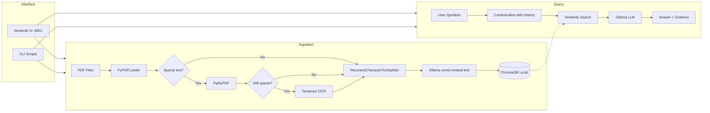
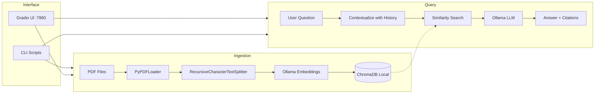

# RAG AI Chatbot — LangChain · Ollama · ChromaDB

A production-ready Retrieval-Augmented Generation (RAG) chatbot that ingests PDFs (including scanned/image-based documents via OCR), stores them in a local ChromaDB vector database, and generates grounded answers using local Ollama LLMs. Fully local — zero API keys, zero cloud costs.

---

## Original Project Brief

> **Overview — Ongoing work**
>
> A custom AI chatbot built using LangChain, ChatGPT/OpenAI, and Pinecone to create a PDF knowledge base.

**Original scope of work:**

- Develop a full RAG chatbot using LangChain / LangGraph
- Integrate ChatGPT / GPT-4o (or preferred OpenAI model) for natural, accurate responses
- Set up Pinecone as the vector database for efficient storage and semantic retrieval
- Build a PDF-based knowledge base: support multiple PDFs, intelligent chunking, embeddings, and metadata handling
- Implement conversation memory so the chatbot remembers previous questions
- Provide a clean, user-friendly interface (Streamlit/Gradio) or API endpoint ready for integration
- Thorough testing with sample questions + handover documentation (how to add new PDFs yourself)
- Deliver the complete working project within 10 business days
- Include 1 week of free post-delivery support and 2 rounds of revisions

**How the delivered project maps to the brief:**

| Original requirement | Delivered implementation |
|---|---|
| LangChain / LangGraph | Both implemented; switchable at runtime |
| ChatGPT / OpenAI | Replaced with Ollama (local, free, no API key required) |
| Pinecone vector DB | Replaced with ChromaDB (local, persistent, no account needed) |
| PDF knowledge base with chunking | Multi-stage pipeline: PyPDF → PyMuPDF → Tesseract OCR fallback |
| Conversation memory | Windowed buffer (LangChain) + MemorySaver checkpointer (LangGraph) |
| Clean UI | Streamlit — dark, minimalist, multi-tab |
| Testing + documentation | pytest suite with mocked dependencies; this README |

> The switch from OpenAI → Ollama and Pinecone → ChromaDB makes the system fully self-hosted, removing ongoing API costs while keeping all functionality.

---

## Table of Contents

- [Architecture](#architecture)
- [How It Works](#how-it-works)
- [Features](#features)
- [Project Structure](#project-structure)
- [Prerequisites](#prerequisites)
- [Setup](#setup)
- [Configuration](#configuration)
- [Usage](#usage)
  - [Launching the Web UI](#launching-the-web-ui)
  - [Ingesting PDFs (CLI)](#ingesting-pdfs-cli)
  - [CLI Querying](#cli-querying)
  - [Docker](#docker)
- [UI Overview](#ui-overview)
  - [Sidebar](#sidebar)
  - [Chat Tab](#chat-tab)
  - [Multi-Model Analysis Tab](#multi-model-analysis-tab)
  - [Insights Tab](#insights-tab)
- [Supported Models](#supported-models)
- [Orchestration Modes](#orchestration-modes)
- [PDF Ingestion Pipeline](#pdf-ingestion-pipeline)
- [OCR Support](#ocr-support)
- [Prompt Customization](#prompt-customization)
- [Tuning Retrieval Quality](#tuning-retrieval-quality)
- [Re-ingesting and Deduplication](#re-ingesting-and-deduplication)
- [Adding New PDFs](#adding-new-pdfs)
- [Testing](#testing)
- [Roadmap](#roadmap)
- [License](#license)

---

## Architecture



---

## How It Works

1. **Ingestion** — PDFs are processed through a 3-stage pipeline. Text is extracted with `PyPDFLoader`, falling back to `PyMuPDF` for better accuracy, and finally to Tesseract OCR for scanned/image-based documents. Chunks are embedded with Ollama `nomic-embed-text` (768 dimensions) and stored in ChromaDB with deterministic SHA-256 IDs.

2. **Query contextualization** — Follow-up questions are rewritten to be standalone using the full chat history (e.g., "Tell me more" → "Tell me more about the revenue projections in the Q3 report").

3. **Retrieval** — The standalone question is embedded and compared via cosine similarity against ChromaDB, returning the top-K most relevant chunks with their source metadata.

4. **Generation** — Retrieved chunks are injected into a system prompt that instructs the LLM to answer only from the provided context and cite sources with filename and page number.

5. **Memory** — Per-session conversation history is maintained. LangChain mode uses a windowed in-memory buffer; LangGraph mode uses `MemorySaver` that persists state per thread.

---

## Features

- **PDF Knowledge Base** — Upload and ingest multiple PDFs; intelligent chunking with per-chunk metadata (source, page, chunk index)
- **OCR Support** — 3-stage extraction pipeline handles scanned and image-based PDFs via Tesseract; no manual pre-processing required
- **Fully Local** — Runs entirely on your machine using Ollama and ChromaDB. No API keys, no subscriptions, no data leaves your machine
- **Multi-Model Support** — Choose from `llama3.2:1b`, `llama3.2`, `mistral`, and `gemma2:2b` at runtime; pull uninstalled models directly from the sidebar
- **Multi-Model Analysis** — Run a single question across multiple models in parallel, compare responses side-by-side with quality scores, word counts, and response times
- **Auto-Insights** — One-click generation of executive summary, key metrics, risk analysis, and actionable recommendations from your entire knowledge base
- **Semantic Search** — ChromaDB cosine similarity retrieval with configurable top-K
- **Conversation Memory** — Chatbot remembers previous questions within a session
- **Dual Orchestration** — LangChain LCEL and LangGraph modes, switchable at runtime
- **Source Citations** — Every answer includes filename and page number references
- **Streamlit Web UI** — Modern dark-themed interface with model selector, orchestration toggle, top-K slider, and in-browser PDF upload
- **Retry with Different Model** — After any response, retry the same question with a different model in one click
- **CLI Tools** — Bulk PDF ingestion script and headless query script for automation
- **Docker Ready** — Dockerfile and docker-compose.yml for containerized deployment
- **Deterministic Deduplication** — Hash-based vector IDs prevent duplicate vectors when re-ingesting

---

## Project Structure

```
rag-ai-chat-bot-with-langchain/
├── app/
│   ├── __init__.py
│   ├── config.py          # Central settings (pydantic-settings), SUPPORTED_MODELS list
│   ├── ingestion.py       # 3-stage PDF pipeline: PyPDF → PyMuPDF → Tesseract OCR
│   ├── embeddings.py      # Ollama nomic-embed-text wrapper (cached singleton)
│   ├── vectorstore.py     # ChromaDB client, collection init, batched upsert, get_doc_count()
│   ├── retriever.py       # Similarity retriever with configurable top-K
│   ├── memory.py          # Windowed chat history + LangGraph MemorySaver factory
│   ├── prompts.py         # Shared prompt templates (contextualize + QA)
│   ├── chain.py           # LangChain LCEL RAG chain
│   ├── graph.py           # LangGraph stateful RAG graph
│   ├── analysis.py        # Multi-model parallel analysis, quality scoring, insights generation
│   └── ui.py              # Streamlit UI (Chat, Multi-Model Analysis, Insights tabs)
├── scripts/
│   ├── __init__.py
│   ├── ingest_pdfs.py     # CLI: bulk PDF ingestion with progress logging
│   └── query_cli.py       # CLI: query the knowledge base without the UI
├── tests/
│   ├── __init__.py
│   ├── test_ingestion.py
│   ├── test_retriever.py
│   ├── test_chain.py
│   └── test_graph.py
├── data/
│   ├── pdfs/              # Drop PDF files here for CLI ingestion (gitignored)
│   └── chroma/            # ChromaDB persistent storage (gitignored)
├── .env.example
├── pyproject.toml
├── requirements.txt
├── Dockerfile
└── docker-compose.yml
```

---

## Prerequisites

- Python 3.11+
- [Ollama](https://ollama.com/) installed and running locally
- Tesseract OCR (only needed for scanned PDFs — see [OCR Support](#ocr-support))
- (Optional) Docker and Docker Compose

---

## Setup

### 1. Clone the repository

```bash
git clone <repo-url>
cd rag-ai-chat-bot-with-langchain
```

### 2. Install and start Ollama

```bash
# macOS
brew install ollama
brew services start ollama

# Pull the minimum required models
ollama pull llama3.2:1b        # fast 1B chat model (~700 MB)
ollama pull nomic-embed-text   # embedding model (required for all RAG operations)

# Optional: pull additional supported models
ollama pull llama3.2           # 3B model (~2 GB)
ollama pull mistral            # Mistral 7B (~4 GB)
ollama pull gemma2:2b          # Google Gemma 2B (~1.6 GB)
```

See [ollama.com](https://ollama.com/) for Linux/Windows install instructions. You can also pull models directly from the app sidebar without using the terminal.

### 3. Create a virtual environment

```bash
python -m venv .venv
source .venv/bin/activate   # macOS/Linux
# .venv\Scripts\activate    # Windows
```

### 4. Install dependencies

```bash
pip install -r requirements.txt
```

### 5. (Optional) Install Tesseract for OCR

Only needed if you have scanned or image-based PDFs.

```bash
# macOS
brew install tesseract

# Ubuntu/Debian
sudo apt install tesseract-ocr
```

### 6. Configure environment variables

```bash
cp .env.example .env
```

All variables have sensible defaults and work out of the box. See [Configuration](#configuration) for the full list.

---

## Configuration

All settings are managed by `pydantic-settings` in `app/config.py` and loaded from environment variables or a `.env` file.

| Variable | Default | Description |
|---|---|---|
| `OLLAMA_BASE_URL` | `http://localhost:11434` | Ollama server URL |
| `OLLAMA_MODEL` | `llama3.2:1b` | Default LLM model for chat |
| `OLLAMA_EMBEDDING_MODEL` | `nomic-embed-text` | Embedding model (768 dimensions) |
| `CHROMA_PERSIST_DIR` | `data/chroma` | Directory for ChromaDB persistent storage |
| `CHROMA_COLLECTION_NAME` | `rag-chatbot` | ChromaDB collection name |
| `CHUNK_SIZE` | `1000` | Maximum characters per text chunk |
| `CHUNK_OVERLAP` | `200` | Character overlap between consecutive chunks |
| `TOP_K` | `5` | Number of documents retrieved per query |
| `MEMORY_WINDOW` | `10` | Conversation turns (Q+A pairs) to keep in memory |

Settings are cached as a singleton via `@lru_cache` on `get_settings()`.

---

## Usage

### Launching the Web UI

```bash
streamlit run app/ui.py
```

Open [http://localhost:8501](http://localhost:8501).

### Ingesting PDFs (CLI)

Place PDF files in `data/pdfs/` (or any directory), then run:

```bash
# Default directory: data/pdfs/
python -m scripts.ingest_pdfs

# Custom directory
python -m scripts.ingest_pdfs --pdf-dir /path/to/your/pdfs
```

For quick ingestion via the browser, use the **sidebar → Knowledge Base** section in the UI instead.

### CLI Querying

```bash
# Query using LangChain LCEL chain (default)
python -m scripts.query_cli "What does the document say about revenue growth?"

# Query using LangGraph
python -m scripts.query_cli "What are the key findings?" --mode graph

# Override model and top-k
python -m scripts.query_cli "Summarize section 3" --model mistral --top-k 8

# Maintain conversation across queries (same session ID)
python -m scripts.query_cli "What is RAG?" --session-id my-session
python -m scripts.query_cli "How does it differ from fine-tuning?" --session-id my-session
```

### Docker

```bash
docker-compose up --build
```

The UI will be available at [http://localhost:8501](http://localhost:8501).

To ingest PDFs from inside the container:

```bash
docker-compose exec chatbot python -m scripts.ingest_pdfs
```

---

## UI Overview

### Sidebar

| Control | Description |
|---|---|
| **Ollama status** | Live connection indicator — green if Ollama is running |
| **Chat model** | Select the model used for chat responses |
| **Install status** | Green "Installed" / red "Not installed" badge for the selected model |
| **Pull button** | Downloads the selected model from Ollama if not yet installed (streams progress) |
| **Mode** | Switch between LangChain and LangGraph orchestration |
| **Retrieved chunks** | Top-K slider (1–15) — how many document chunks to retrieve per query |
| **PDFs** | Upload one or more PDFs for immediate ingestion |
| **Upload & Index** | Processes uploaded PDFs through the ingestion pipeline |
| **Clear KB** | Removes all vectors from ChromaDB |
| **Clear Chat** | Resets the current session's conversation history |

### Chat Tab

- Type any question in the input bar — the chatbot retrieves relevant document chunks and answers with source citations
- **Suggested questions** appear when the chat is empty to help you get started
- **Retry bar** — after each response, retry the same question with a different model in one click without re-typing

### Multi-Model Analysis Tab

Run a question across multiple models simultaneously and compare results:

1. Select which models to include (defaults to installed models only)
2. Enter your question
3. Click **Run** — all models are queried in parallel
4. Results are ranked by a quality score (0–100) factoring response length, structure, and specificity
5. Each result shows word count, response time, and quality score
6. The best result is auto-expanded and marked with a star

### Insights Tab

One-click structured analysis of your entire knowledge base:

1. Select the model to use
2. Click **Generate Insights**
3. The system runs 4 parallel analysis questions and returns:
   - **Executive Summary** — overview of all documents
   - **Key Metrics & Data Points** — extracted numbers, dates, percentages
   - **Risk Analysis** — identified risks categorized by severity
   - **Actionable Recommendations** — prioritized next steps

---

## Supported Models

The following models are supported and selectable at runtime:

| Model | Size | Notes |
|---|---|---|
| `llama3.2:1b` | ~700 MB | Default; fast responses, lower quality |
| `llama3.2` | ~2 GB | Better reasoning, same family |
| `mistral` | ~4 GB | Strong general-purpose model |
| `gemma2:2b` | ~1.6 GB | Google Gemma; efficient at 2B scale |

All models can be pulled directly from the sidebar without leaving the app. The `nomic-embed-text` embedding model is required regardless of which chat model you choose.

---

## Orchestration Modes

### LangChain LCEL (`app/chain.py`)

Uses LangChain Expression Language with:
- `create_history_aware_retriever` — rewrites questions to be standalone given chat history
- `create_stuff_documents_chain` — stuffs retrieved documents into the QA prompt
- `create_retrieval_chain` — composes the full retrieval + generation pipeline

Memory is handled via an in-memory windowed buffer keyed by session ID.

### LangGraph (`app/graph.py`)

Uses a stateful `StateGraph` with three nodes:

1. **contextualize** — Rewrites the question if there is prior conversation history
2. **retrieve** — Fetches relevant documents from ChromaDB
3. **generate** — Produces the answer with citations

Compiled with a `MemorySaver` checkpointer — state is persisted per `thread_id` automatically.

Both modes use the same prompts from `app/prompts.py` and return the same output format:

```python
{"answer": str, "sources": [{"source": str, "page": int}]}
```

---

## PDF Ingestion Pipeline

`app/ingestion.py` uses a 3-stage extraction pipeline:

1. **PyPDFLoader** — Fast text extraction; works on the majority of digitally-created PDFs
2. **PyMuPDF (fitz)** — More accurate text extraction; used when PyPDF yields fewer than 80 characters per page on average
3. **Tesseract OCR** — Full OCR via `pdf2image` + `pytesseract`; used when the document appears to be scanned or image-based (still sparse after stage 2)

After extraction:

- `RecursiveCharacterTextSplitter` splits text using `["\n\n", "\n", " ", ""]` separators
- Each chunk gets metadata: `source` (filename), `page`, `chunk_index`
- A deterministic vector ID is computed as `SHA256(filename::page::chunk_index)` — re-ingesting the same file overwrites rather than duplicates
- Chunks are embedded via `nomic-embed-text` and stored in ChromaDB in batches of 100

---

## OCR Support

For scanned or image-based PDFs (where text cannot be extracted directly):

**Install dependencies:**

```bash
# Tesseract engine
brew install tesseract         # macOS
sudo apt install tesseract-ocr # Ubuntu/Debian

# Python packages (already in requirements.txt)
pip install pymupdf pdf2image pytesseract
```

The ingestion pipeline detects sparse text automatically — no configuration required. Documents with fewer than 80 characters per page on average are sent through OCR.

---

## Prompt Customization

Both orchestration modes share the prompts in `app/prompts.py`:

**`CONTEXTUALIZE_SYSTEM`** — Rewrites follow-up questions to be standalone. Adjust aggressiveness here.

**`QA_SYSTEM`** — Controls answer style. Default rules:
- Answer only from the provided context
- Cite sources as `(source: filename.pdf, page N)`
- Decline gracefully when context is insufficient

Edit these strings and restart the app. No re-ingestion is needed.

The multi-model analysis prompts are in `app/analysis.py` (`_ANALYST_PROMPT` and `_INSIGHTS_QUESTIONS`).

---

## Tuning Retrieval Quality

| Parameter | Effect | Trade-off |
|---|---|---|
| `TOP_K` | Chunks retrieved per query | Higher = more context but more tokens and potential noise |
| `CHUNK_SIZE` | Characters per chunk | Larger = more context per chunk; smaller = more precise matches |
| `CHUNK_OVERLAP` | Overlap between adjacent chunks | Higher = better continuity at boundaries but more total chunks |
| `MEMORY_WINDOW` | Conversation turns kept | Higher = better multi-turn coherence but more tokens per request |
| Model choice | LLM capability | Larger models produce better reasoning but are slower |

After changing `CHUNK_SIZE` or `CHUNK_OVERLAP`, re-ingest all PDFs for the new settings to take effect. All other settings take effect immediately.

---

## Re-ingesting and Deduplication

- **Same PDF, same filename** — Re-ingesting produces the same deterministic vector IDs; existing vectors are overwritten. No duplicates.
- **Renamed PDF** — A different filename produces different IDs; new vectors are created alongside the old ones.
- **Full reset** — Click **Clear KB** in the sidebar, or delete `data/chroma/` and restart.

---

## Adding New PDFs

**Via the UI (recommended):**

1. Open the sidebar → **Knowledge Base** section
2. Click the file picker and select one or more PDFs
3. Click **Upload & Index**
4. A progress bar shows per-file status; chunk counts are reported on completion

**Via the CLI:**

```bash
# Copy PDFs to data/pdfs/ then run:
python -m scripts.ingest_pdfs

# Or point at any directory:
python -m scripts.ingest_pdfs --pdf-dir /path/to/new/docs
```

The system handles deduplication automatically — safe to run multiple times with the same files.

---

## Testing

All tests use mocked dependencies — no running Ollama instance is needed.

```bash
# Run all tests
pytest tests/ -v

# Run a specific file
pytest tests/test_ingestion.py -v

# Run a single test
pytest tests/test_graph.py::test_contextualize_with_history -v
```

Test coverage:

| File | What is tested |
|---|---|
| `test_ingestion.py` | Chunk ID determinism, uniqueness, PDF loading + chunking with metadata, empty directory |
| `test_retriever.py` | Default top-K, custom top-K override |
| `test_chain.py` | Full LCEL chain with sources, empty context handling |
| `test_graph.py` | GraphState typing, contextualization without/with history, retrieval, generation |

---

## Roadmap

- [ ] Streaming chat responses (token-by-token output)
- [ ] FastAPI endpoint for programmatic / headless access
- [ ] Export analysis results as PDF or Markdown
- [ ] Metadata filtering (filter by source PDF, date range)
- [ ] Hybrid search (keyword + semantic retrieval)
- [ ] Async ingestion for large PDF batches
- [ ] RAGAS evaluation framework for measuring answer quality
- [ ] Authentication and per-user knowledge bases
- [ ] Support for additional file types (DOCX, TXT, HTML, EPUB)

---

## License

MIT


---

## Table of Contents

- [Architecture](#architecture)
- [How It Works](#how-it-works)
- [Features](#features)
- [Project Structure](#project-structure)
- [Prerequisites](#prerequisites)
- [Setup](#setup)
- [Configuration](#configuration)
- [Usage](#usage)
  - [Ingesting PDFs](#ingesting-pdfs)
  - [Launching the Web UI](#launching-the-web-ui)
  - [CLI Querying](#cli-querying)
  - [Docker](#docker)
- [Orchestration Modes](#orchestration-modes)
- [PDF Ingestion Pipeline Details](#pdf-ingestion-pipeline-details)
- [Prompt Customization](#prompt-customization)
- [Tuning Retrieval Quality](#tuning-retrieval-quality)
- [Re-ingesting and Deduplication](#re-ingesting-and-deduplication)
- [Testing](#testing)
- [Roadmap](#roadmap)
- [License](#license)

---

## Architecture



## How It Works

1. **Ingestion** -- PDFs are loaded page-by-page with `PyPDFLoader`, split into overlapping chunks via `RecursiveCharacterTextSplitter`, embedded with Ollama `nomic-embed-text` (768 dimensions), and stored in a local ChromaDB collection. Each vector gets a deterministic SHA-256 ID based on `filename::page::chunk_index` so re-ingesting the same file overwrites rather than duplicates.

2. **Query contextualization** -- When a user asks a follow-up question, the system first passes the full chat history and the new question through a contextualization prompt that rewrites the question to be standalone (e.g., "Tell me more" becomes "Tell me more about Retrieval-Augmented Generation").

3. **Retrieval** -- The standalone question is embedded and used to run a cosine similarity search against ChromaDB, returning the top-K most relevant chunks along with their metadata (source filename, page number).

4. **Generation** -- The retrieved chunks are injected into a system prompt that instructs the Ollama LLM to answer based only on the provided context, cite sources with filename and page, and decline gracefully when the context is insufficient.

5. **Memory** -- Conversation history is maintained per session. The LangChain mode uses a windowed in-memory buffer; the LangGraph mode uses a `MemorySaver` checkpointer that persists state per thread automatically.

## Features

- **PDF Knowledge Base** -- Upload and ingest multiple PDFs with intelligent chunking and per-chunk metadata (source, page, chunk index)
- **Fully Local** -- Runs entirely on your machine using Ollama (LLM + embeddings) and ChromaDB (vector store). No API keys, no cloud costs
- **Semantic Search** -- ChromaDB vector database with cosine similarity retrieval and configurable top-K
- **Conversation Memory** -- Chatbot remembers previous questions within a session (configurable window size)
- **Dual Orchestration** -- Switch between LangChain (LCEL) and LangGraph modes at runtime via the UI
- **Source Citations** -- Every answer includes filename and page number references
- **Gradio Web UI** -- Clean interface with model selector, orchestration toggle, top-K slider, and in-browser PDF upload with live ingestion
- **CLI Tools** -- Bulk PDF ingestion script and a headless query script for scripting/testing
- **Docker Ready** -- Dockerfile and docker-compose.yml for containerized deployment
- **Deterministic Deduplication** -- Hash-based vector IDs prevent duplicate vectors when re-ingesting the same PDF

## Project Structure

```
rag-ai-chat-bot-with-langchain/
|-- app/
|   |-- __init__.py
|   |-- config.py          # Central settings via pydantic-settings, loads .env
|   |-- ingestion.py       # PDF loading (PyPDFLoader), chunking (RecursiveCharacterTextSplitter), metadata
|   |-- embeddings.py      # Ollama nomic-embed-text wrapper (cached singleton)
|   |-- vectorstore.py     # ChromaDB local client, collection init, batched upsert
|   |-- retriever.py       # Builds a similarity retriever from the vector store with configurable top-K
|   |-- memory.py          # In-memory windowed chat history + LangGraph MemorySaver factory
|   |-- prompts.py         # Shared prompt templates (contextualize + QA) used by both orchestration modes
|   |-- chain.py           # LangChain LCEL RAG chain (create_history_aware_retriever + create_retrieval_chain)
|   |-- graph.py           # LangGraph stateful RAG graph (contextualize -> retrieve -> generate nodes)
|   |-- ui.py              # Gradio Blocks UI with settings sidebar and PDF upload
|-- scripts/
|   |-- __init__.py
|   |-- ingest_pdfs.py     # CLI: bulk PDF ingestion with progress logging
|   |-- query_cli.py       # CLI: query the knowledge base without the UI
|-- tests/
|   |-- __init__.py
|   |-- test_ingestion.py  # Chunking, metadata, dedup ID tests
|   |-- test_retriever.py  # Retriever factory tests with mocked vector store
|   |-- test_chain.py      # LCEL chain end-to-end tests with mocked LLM
|   |-- test_graph.py      # LangGraph node-level tests (contextualize, retrieve, generate)
|-- data/
|   |-- pdfs/              # Drop PDF files here for ingestion (gitignored)
|   |-- chroma/            # ChromaDB persistent storage (gitignored)
|-- .env.example           # Template for required environment variables
|-- .gitignore
|-- pyproject.toml         # Project metadata, dependencies, pytest config
|-- requirements.txt       # Pinned dependency list
|-- Dockerfile             # Python 3.12-slim container
|-- docker-compose.yml     # Single-service deployment with env and volume mounts
|-- README.md
```

## Prerequisites

- Python 3.11+
- [Ollama](https://ollama.com/) installed and running locally
- (Optional) Docker and Docker Compose for containerized deployment

## Setup

### 1. Clone the repository

```bash
git clone <repo-url>
cd rag-ai-chat-bot-with-langchain
```

### 2. Install and start Ollama

```bash
# macOS
brew install ollama
brew services start ollama

# Pull the required models
ollama pull llama3.2:1b
ollama pull nomic-embed-text
```

See [ollama.com](https://ollama.com/) for Linux/Windows install instructions.

### 3. Create a virtual environment

```bash
python -m venv .venv
source .venv/bin/activate   # macOS/Linux
# .venv\Scripts\activate    # Windows
```

### 4. Install dependencies

```bash
pip install -r requirements.txt
```

### 5. Configure environment variables (optional)

```bash
cp .env.example .env
```

All variables have sensible defaults and work out of the box. See [Configuration](#configuration) for the full list.

## Configuration

All settings are managed by `pydantic-settings` in `app/config.py` and loaded from environment variables or a `.env` file.

| Variable | Default | Description |
|----------|---------|-------------|
| `OLLAMA_BASE_URL` | `http://localhost:11434` | Ollama server URL |
| `OLLAMA_MODEL` | `llama3.2:1b` | LLM model for answer generation |
| `OLLAMA_EMBEDDING_MODEL` | `nomic-embed-text` | Embedding model (768 dimensions) |
| `CHROMA_PERSIST_DIR` | `data/chroma` | Directory for ChromaDB persistent storage |
| `CHROMA_COLLECTION_NAME` | `rag-chatbot` | ChromaDB collection name |
| `CHUNK_SIZE` | `1000` | Maximum characters per text chunk |
| `CHUNK_OVERLAP` | `200` | Character overlap between consecutive chunks |
| `TOP_K` | `5` | Number of documents retrieved per query |
| `MEMORY_WINDOW` | `10` | Number of conversation turns (Q+A pairs) to keep in memory |

Settings are cached as a singleton via `@lru_cache` on `get_settings()`, so they are only read once per process.

## Usage

### Ingesting PDFs

Place your PDF files in `data/pdfs/` (or any directory), then run:

```bash
# Default directory: data/pdfs/
python -m scripts.ingest_pdfs

# Custom directory
python -m scripts.ingest_pdfs --pdf-dir /path/to/your/pdfs
```

The script will:
1. Load each PDF page-by-page with `PyPDFLoader`
2. Split pages into chunks using `RecursiveCharacterTextSplitter` (respecting `CHUNK_SIZE` and `CHUNK_OVERLAP`)
3. Attach metadata: `source` (filename), `page` (page number), `chunk_index`, and a deterministic `id`
4. Embed all chunks with Ollama `nomic-embed-text`
5. Store in ChromaDB in batches of 100
6. Print a summary with total chunks and elapsed time

### Launching the Web UI

```bash
python -m app.ui
```

Open [http://localhost:7860](http://localhost:7860). The UI provides:

- **Chat panel** -- Type questions and receive answers with source citations
- **Model selector** -- Switch between Ollama models (`llama3.2:1b`, `llama3.2`, `mistral`, `gemma2:2b`) at runtime
- **Orchestration toggle** -- Switch between LangChain and LangGraph modes
- **Top-K slider** -- Adjust how many documents are retrieved (1-10)
- **Clear conversation** -- Reset the chat history for the current session
- **PDF upload** -- Upload one or more PDFs directly in the browser; they are chunked, embedded, and ingested immediately

### CLI Querying

For scripting or testing without the UI:

```bash
# Query using LangChain LCEL chain (default)
python -m scripts.query_cli "What does the document say about revenue growth?"

# Query using LangGraph
python -m scripts.query_cli "What are the key findings?" --mode graph

# Override model and top-k
python -m scripts.query_cli "Summarize section 3" --model mistral --top-k 8

# Maintain conversation across queries (same session ID)
python -m scripts.query_cli "What is RAG?" --session-id my-session
python -m scripts.query_cli "How does it differ from fine-tuning?" --session-id my-session
```

### Docker

Build and run with Docker Compose:

```bash
docker-compose up --build
```

The UI will be available at [http://localhost:7860](http://localhost:7860).

The `data/pdfs/` directory is mounted as a volume, so you can add PDFs on the host and ingest them from inside the container:

```bash
docker-compose exec chatbot python -m scripts.ingest_pdfs
```

## Orchestration Modes

The project implements the same RAG pipeline in two ways, switchable at runtime:

### LangChain LCEL (`app/chain.py`)

Uses LangChain Expression Language with:
- `create_history_aware_retriever` -- Rewrites the user question to be standalone given chat history
- `create_stuff_documents_chain` -- Stuffs retrieved documents into the QA prompt
- `create_retrieval_chain` -- Composes the full retrieval + generation pipeline

Memory is handled manually via an in-memory windowed buffer (`app/memory.py`) keyed by session ID.

### LangGraph (`app/graph.py`)

Uses a stateful `StateGraph` with three nodes:

1. **contextualize** -- Rewrites the question if there is prior conversation history
2. **retrieve** -- Fetches relevant documents from ChromaDB
3. **generate** -- Produces the answer with citations

The graph is compiled with a `MemorySaver` checkpointer, so conversation state is automatically persisted per `thread_id`. The edge flow is: `START -> contextualize -> retrieve -> generate -> END`.

Both modes use the same prompt templates from `app/prompts.py` and produce identical output format: `{"answer": str, "sources": [{"source": str, "page": int}]}`.

## PDF Ingestion Pipeline Details

The ingestion pipeline (`app/ingestion.py`) works as follows:

1. `PyPDFLoader` extracts text from each page, preserving page numbers in metadata
2. `RecursiveCharacterTextSplitter` splits text using the separator hierarchy: `["\n\n", "\n", " ", ""]`, targeting `CHUNK_SIZE` characters with `CHUNK_OVERLAP` overlap
3. Each chunk gets metadata: `source` (PDF filename), `page` (original page number), `chunk_index` (sequential within the PDF)
4. A deterministic vector ID is computed as `SHA256(filename::page::chunk_index)` -- this ensures re-ingesting the same PDF overwrites existing vectors rather than creating duplicates
5. Chunks are embedded via Ollama `nomic-embed-text` (768 dimensions) and stored in ChromaDB in batches of 100

ChromaDB persists data locally to `data/chroma/` by default. No cloud service or API key is needed.

## Prompt Customization

Both orchestration modes share the same prompts defined in `app/prompts.py`:

**Contextualization prompt** (`CONTEXTUALIZE_SYSTEM`): Rewrites follow-up questions to be standalone. Edit this to change how aggressively the system reformulates questions.

**QA prompt** (`QA_SYSTEM`): Controls the answer style. Current rules:
- Answer only from the provided context
- Cite sources as `(source: filename.pdf, page N)`
- Decline gracefully when context is insufficient

Edit these strings and restart the app. No re-ingestion is needed -- prompts only affect the generation step.

## Tuning Retrieval Quality

| Parameter | Effect | Trade-off |
|-----------|--------|-----------|
| `TOP_K` | Number of chunks retrieved per query | Higher = more context but more tokens and potential noise |
| `CHUNK_SIZE` | Characters per chunk | Larger = more context per chunk but fewer total chunks; smaller = more precise matches |
| `CHUNK_OVERLAP` | Overlap between adjacent chunks | Higher = better continuity at chunk boundaries but more total chunks |
| `MEMORY_WINDOW` | Conversation turns kept | Higher = better multi-turn coherence but more tokens per request |
| `OLLAMA_MODEL` | LLM model | Larger models (e.g., `llama3.2` 3B) are more capable but slower than `llama3.2:1b` |

After changing `CHUNK_SIZE` or `CHUNK_OVERLAP`, you must re-ingest all PDFs for the new chunking to take effect. Other settings take effect immediately on the next query.

## Re-ingesting and Deduplication

- **Same PDF, same filename**: Re-ingesting produces the same deterministic vector IDs, so existing vectors are overwritten. No duplicates.
- **Renamed PDF**: A different filename produces different IDs, so new vectors are created alongside the old ones.
- **Full reset**: Delete the `data/chroma/` directory, then re-ingest. ChromaDB will recreate the collection on next use.

## Testing

All tests use mocked dependencies -- no running Ollama instance needed to run them.

```bash
# Run all tests with verbose output
pytest tests/ -v

# Run a specific test file
pytest tests/test_ingestion.py -v

# Run a single test
pytest tests/test_graph.py::test_contextualize_with_history -v
```

Current test coverage:
- `test_ingestion.py` -- Chunk ID determinism, chunk ID uniqueness, PDF loading + chunking with metadata, empty directory handling
- `test_retriever.py` -- Default top-K, custom top-K override
- `test_chain.py` -- Full LCEL chain invoke with sources, empty context handling
- `test_graph.py` -- GraphState typing, contextualization without history, contextualization with history, retrieval, answer generation

## Roadmap

Potential future enhancements:

- [ ] Streaming responses (token-by-token output in the UI)
- [ ] Authentication and multi-tenancy (per-user knowledge bases)
- [ ] Metadata filtering (filter by source PDF, date range, etc.)
- [ ] Hybrid search (combine keyword + semantic retrieval)
- [ ] Async ingestion for large PDF batches
- [ ] FastAPI endpoint for programmatic access
- [ ] Support for additional file types (DOCX, TXT, HTML)
- [ ] Evaluation framework (RAGAS or similar) for measuring answer quality

## License

MIT
