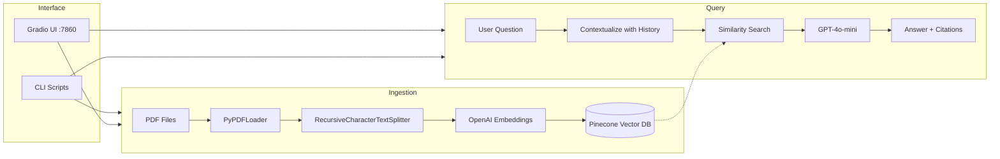

# RAG AI Chatbot with LangChain + Pinecone

A production-ready Retrieval-Augmented Generation (RAG) chatbot that ingests PDFs into Pinecone, retrieves relevant context via semantic search, and generates answers using OpenAI GPT-4o-mini — with conversation memory and a Gradio UI.

## Architecture



## Features

- **PDF Knowledge Base** — Upload and ingest multiple PDFs with intelligent chunking and metadata
- **Semantic Search** — Pinecone vector database with cosine similarity retrieval
- **Conversation Memory** — Chatbot remembers previous questions within a session
- **Dual Orchestration** — Switch between LangChain (LCEL) and LangGraph modes in the UI
- **Source Citations** — Every answer includes filename and page number references
- **Gradio UI** — Clean interface with settings panel and PDF upload
- **Docker Ready** — Containerized deployment with docker-compose

## Quick Start

### 1. Clone and install

```bash
git clone <repo-url>
cd rag-ai-chat-bot-with-langchain
python -m venv .venv
source .venv/bin/activate
pip install -r requirements.txt
```

### 2. Configure environment

```bash
cp .env.example .env
# Edit .env with your API keys:
#   OPENAI_API_KEY=sk-...
#   PINECONE_API_KEY=pcsk_...
```

### 3. Ingest PDFs

Drop your PDF files into `data/pdfs/`, then:

```bash
python -m scripts.ingest_pdfs
# Or specify a custom directory:
python -m scripts.ingest_pdfs --pdf-dir /path/to/pdfs
```

### 4. Launch the chatbot

```bash
python -m app.ui
# Open http://localhost:7860
```

### Docker

```bash
docker-compose up --build
# Open http://localhost:7860
```

## Project Structure

```
app/
├── config.py         # Settings via pydantic-settings (.env)
├── ingestion.py      # PDF loading, chunking, metadata
├── embeddings.py     # OpenAI embedding wrapper
├── vectorstore.py    # Pinecone index management + upsert
├── retriever.py      # Pinecone similarity retriever
├── memory.py         # Conversation memory (both modes)
├── prompts.py        # Shared prompt templates
├── chain.py          # LangChain LCEL RAG chain
├── graph.py          # LangGraph stateful RAG graph
└── ui.py             # Gradio interface
scripts/
├── ingest_pdfs.py    # CLI: bulk PDF ingestion
└── query_cli.py      # CLI: query without UI
tests/
├── test_ingestion.py
├── test_retriever.py
├── test_chain.py
└── test_graph.py
```

## Environment Variables

| Variable | Default | Description |
|----------|---------|-------------|
| `OPENAI_API_KEY` | *required* | OpenAI API key |
| `PINECONE_API_KEY` | *required* | Pinecone API key |
| `PINECONE_INDEX_NAME` | `rag-chatbot` | Pinecone index name |
| `OPENAI_MODEL` | `gpt-4o-mini` | LLM model for generation |
| `EMBEDDING_MODEL` | `text-embedding-3-small` | Embedding model |
| `CHUNK_SIZE` | `1000` | Characters per chunk |
| `CHUNK_OVERLAP` | `200` | Overlap between chunks |
| `TOP_K` | `5` | Number of documents to retrieve |
| `MEMORY_WINDOW` | `10` | Conversation turns to remember |

## CLI Usage

```bash
# Query via LangChain chain
python -m scripts.query_cli "What does the document say about X?"

# Query via LangGraph
python -m scripts.query_cli "What does the document say about X?" --mode graph

# Custom model and top-k
python -m scripts.query_cli "Summarize the key findings" --model gpt-4o --top-k 8
```

## Testing

```bash
pip install -r requirements.txt  # includes pytest
pytest tests/ -v
```

## License

MIT
