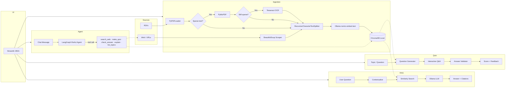

# Exam Prep AI — RAG · Quiz · Web Scraping · Tool Calling

A fully local AI study tool that turns any document or web topic into interactive quizzes. Upload your PDFs, paste a URL, or just name a topic and it scrapes the web — then generates MCQ, True/False, and Short Answer questions, grades your answers with feedback, and explains concepts on demand. Everything runs on your machine via Ollama. No API keys. No cloud costs.

Built on LangChain + LangGraph + ChromaDB + Streamlit.

---

## Quick Start

```bash
# 1. Install Ollama and pull the recommended models
brew install ollama && brew services start ollama   # macOS
ollama pull qwen2.5:7b        # best for quiz generation (structured JSON output)
ollama pull nomic-embed-text  # required for all RAG operations

# 2. Clone and install
git clone <repo-url> && cd rag-ai-chat-bot-with-langchain
python -m venv .venv && source .venv/bin/activate
pip install -r requirements.txt

# 3. (Optional) OCR support for scanned PDFs
brew install tesseract         # macOS
# sudo apt install tesseract-ocr  # Ubuntu/Debian

# 4. Launch
streamlit run app/ui.py
```

Open [http://localhost:8501](http://localhost:8501). Upload a PDF or type a topic in **Quiz Prep** and start studying.

---

## Table of Contents

- [Features](#features)
- [Architecture](#architecture)
- [Project Structure](#project-structure)
- [Prerequisites](#prerequisites)
- [Setup](#setup)
- [Configuration Reference](#configuration-reference)
- [Usage](#usage)
  - [Sidebar: Knowledge Base](#sidebar-knowledge-base)
  - [Chat Tab](#chat-tab)
  - [Quiz Prep Tab](#quiz-prep-tab)
  - [Study Agent Tab](#study-agent-tab)
  - [Multi-Model Analysis Tab](#multi-model-analysis-tab)
  - [Insights Tab](#insights-tab)
  - [CLI Tools](#cli-tools)
  - [Docker](#docker)
- [Supported Models](#supported-models)
- [PDF Ingestion Pipeline](#pdf-ingestion-pipeline)
- [Web Scraping](#web-scraping)
- [Tool Calling Agent](#tool-calling-agent)
- [Orchestration Modes](#orchestration-modes)
- [Configuration Reference](#configuration-reference)
- [Tuning Retrieval Quality](#tuning-retrieval-quality)
- [Testing](#testing)
- [Roadmap](#roadmap)

---

## Features

### Exam & Interview Preparation

- Generate MCQ, True/False, Short Answer, or Mixed questions from any uploaded document or web topic
- Interactive quiz sessions with progress tracking, per-answer feedback, explanations, and a final score breakdown
- Weak-area detection — results screen highlights which topics to review
- Supports any exam type: general exams, technical interviews, job interviews, certifications

### Knowledge Base

- Upload PDFs (including scanned/image-based documents via OCR) — ingested directly in the browser
- Scrape any topic from the web via DuckDuckGo search with Wikipedia fallback — no API key needed
- Persistent ChromaDB vector store with deterministic deduplication (re-ingest the same file safely)

### Study Agent

- Conversational LangGraph agent with 5 tools: search web, generate quiz, grade answer, explain concept, list topics
- Conversation memory persists within a session — ask follow-up questions naturally
- Works with any Ollama model that supports tool calling (`qwen2.5:7b`, `llama3.1:8b`)

### RAG Chatbot

- Document Q&A with source citations (filename + page)
- History-aware retrieval — follow-up questions are rewritten automatically
- Retry any answer with a different model in one click

### Multi-Model Analysis

- Run a question across multiple models in parallel and compare results side-by-side
- Quality scoring (response structure, length, specificity) ranks models automatically
- One-click insight extraction: executive summary, key metrics, risk analysis, recommendations

### Fully Local

- Ollama for LLM inference and embeddings — any supported open-source model
- ChromaDB for persistent vector storage — no account needed
- Zero data leaves your machine

---

## Architecture


```mermaid
flowchart LR
    subgraph Sources
        PDF[PDFs]
        Web[Web / URLs]
    end

    subgraph Ingestion
        PDF --> Stage1[PyPDFLoader]
        Stage1 --> OCR{Sparse text?}
        OCR -- No --> Chunker
        OCR -- Yes --> Stage2[PyMuPDF]
        Stage2 --> OCR2{Still sparse?}
        OCR2 -- No --> Chunker
        OCR2 -- Yes --> Stage3[Tesseract OCR]
        Web --> Scraper[BeautifulSoup Scraper]
        Scraper --> Chunker[RecursiveCharacterTextSplitter]
        Stage3 --> Chunker
        Chunker --> Embedder[Ollama nomic-embed-text]
        Embedder --> ChromaDB[(ChromaDB Local)]
    end

    subgraph RAG
        Question[User Question] --> Ctx[Contextualize]
        Ctx --> Retriever[Similarity Search]
        ChromaDB -.-> Retriever
        Retriever --> LLM[Ollama LLM]
        LLM --> Answer[Answer + Citations]
    end

    subgraph Quiz
        Topic[Topic / Question] --> QuizGen[Question Generator]
        ChromaDB -.-> QuizGen
        QuizGen --> QA[Interactive Q&A]
        QA --> Validator[Answer Validator]
        Validator --> Feedback[Score + Feedback]
    end

    subgraph Agent
        Chat[Chat Message] --> ReAct[LangGraph ReAct Agent]
        ReAct -- tool call --> Tools[search_web · make_quiz · check_answer · explain · list_topics]
        Tools -.-> ChromaDB
        Tools -.-> Web
    end

    subgraph UI
        Streamlit[Streamlit :8501]
    end

    Streamlit --> RAG
    Streamlit --> Quiz
    Streamlit --> Agent
    Streamlit --> Ingestion
```

---

## Project Structure

```text
rag-ai-chat-bot-with-langchain/
├── app/
│   ├── config.py          # Settings (pydantic-settings), SUPPORTED_MODELS list
│   ├── ingestion.py       # 3-stage PDF pipeline: PyPDF → PyMuPDF → Tesseract OCR
│   ├── embeddings.py      # Ollama nomic-embed-text wrapper (cached singleton)
│   ├── vectorstore.py     # ChromaDB client, batched upsert, deduplication
│   ├── retriever.py       # Similarity retriever with configurable top-K
│   ├── memory.py          # Windowed chat history + LangGraph MemorySaver
│   ├── prompts.py         # Shared prompt templates (contextualize + QA)
│   ├── chain.py           # LangChain LCEL RAG chain
│   ├── graph.py           # LangGraph stateful RAG graph
│   ├── analysis.py        # Multi-model parallel analysis + insight generation
│   ├── quiz.py            # Question generation, answer validation, concept explanation
│   ├── scraper.py         # DuckDuckGo search + BeautifulSoup HTML scraper
│   ├── quiz_agent.py      # LangGraph ReAct agent with 5 tools
│   └── ui.py              # Streamlit UI — 5 tabs + sidebar
├── scripts/
│   ├── ingest_pdfs.py     # CLI: bulk PDF ingestion
│   └── query_cli.py       # CLI: headless question answering
├── tests/
│   ├── test_ingestion.py  # PDF pipeline, chunk IDs, metadata
│   ├── test_retriever.py  # Retriever top-K configuration
│   ├── test_chain.py      # LCEL chain with mocked LLM
│   ├── test_graph.py      # LangGraph node-level tests
│   ├── test_quiz.py       # JSON extraction, MCQ/TF grading, question generation
│   ├── test_scraper.py    # HTML extraction, URL scraping, DDG search + fallback
│   └── test_quiz_agent.py # Agent tool wrappers, error handling, n-clamping
├── data/
│   ├── pdfs/              # Drop PDFs here for CLI ingestion (gitignored)
│   └── chroma/            # ChromaDB storage (gitignored)
├── .env.example
├── requirements.txt
├── Dockerfile
└── docker-compose.yml
```

---

## Prerequisites

| Requirement | Notes |
| --- | --- |
| Python 3.11+ | |
| [Ollama](https://ollama.com/) | Must be running before launching the app |
| `nomic-embed-text` model | Required for all RAG and quiz operations |
| Tesseract | Optional — only needed for scanned/image PDFs |
| Docker + Docker Compose | Optional — for containerized deployment |

---

## Setup

### 1. Install Ollama

```bash
# macOS
brew install ollama
brew services start ollama

# Linux
curl -fsSL https://ollama.com/install.sh | sh
ollama serve &   # or use systemd — see ollama.com/docs
```

### 2. Pull models

```bash
# Required
ollama pull nomic-embed-text   # embeddings (~274 MB)

# Recommended for quiz generation (best structured JSON output)
ollama pull qwen2.5:7b         # ~4.7 GB

# Recommended for tool-calling agent
ollama pull llama3.1:8b        # ~4.7 GB

# Lighter alternatives
ollama pull llama3.2:3b        # ~2 GB — good balance
ollama pull llama3.2:1b        # ~700 MB — fastest, lowest quality
```

You can also pull models directly from the app sidebar without using the terminal.

### 3. Clone and install

```bash
git clone <repo-url>
cd rag-ai-chat-bot-with-langchain

python -m venv .venv
source .venv/bin/activate        # macOS/Linux
# .venv\Scripts\activate         # Windows

pip install -r requirements.txt
```

### 4. (Optional) OCR for scanned PDFs

Only needed if you have image-based or scanned PDFs.

```bash
# macOS
brew install tesseract poppler

# Ubuntu/Debian
sudo apt install tesseract-ocr poppler-utils
```

### 5. Environment variables

```bash
cp .env.example .env
```

All variables have sensible defaults. The app works out of the box without editing `.env`. See [Configuration Reference](#configuration-reference) for the full list.

---

## Usage

### Sidebar: Knowledge Base

The sidebar is the primary way to load content before using any tab.

| Control | What it does |
| --- | --- |
| **Ollama status** | Live connection indicator — green dot means Ollama is running |
| **Chat model** | Select the LLM used for chat, analysis, and insights |
| **Pull button** | Downloads a model from Ollama if not yet installed |
| **Mode** | Switch between LangChain and LangGraph orchestration |
| **Retrieved chunks (Top-K)** | How many document chunks to retrieve per query |
| **PDFs → Upload & Index** | Upload PDFs — processed through 3-stage pipeline immediately |
| **Scrape Web** | Type a topic → DuckDuckGo search → scrape + index top pages |
| **Clear KB** | Delete all vectors from ChromaDB |
| **Clear Chat** | Reset the current conversation history |

**Tip:** Load content first before using Quiz Prep or Study Agent. Either upload a PDF or use Scrape Web.

---

### Chat Tab

Standard RAG Q&A against your knowledge base.

1. Upload PDFs or scrape a topic via the sidebar
2. Type any question in the chat input
3. Receive a grounded answer with source citations (filename + page)
4. **Retry bar** — after any response, retry the same question with a different model in one click

Suggested questions appear when the chat is empty to get you started.

---

### Quiz Prep Tab

Interactive quiz sessions driven by your knowledge base.

**Setup:**

| Field | Options |
| --- | --- |
| Topic | Free text — e.g. "binary search trees", "Python decorators" |
| Question type | MCQ · True/False · Short Answer · Mixed |
| Questions | 5 / 10 / 15 / 20 |
| Difficulty | Easy · Medium · Hard · Mixed |
| Exam type | General exam · Technical interview · Job interview · Certification · University exam |
| Generation model | Any installed Ollama model (`qwen2.5:7b` recommended) |

Click **Generate Quiz**. If the knowledge base is empty, the sidebar shows a warning — upload a PDF or use **Scrape Web** first.

**During the quiz:**

- MCQ: radio buttons for A/B/C/D options
- True/False: radio buttons for True/False
- Short Answer: text area
- Submit → instant feedback with score, explanation, and what you missed

**Results screen:**

- Final score (X/Y and percentage)
- Per-question breakdown (correct/incorrect, your answer vs correct answer)
- Weak areas highlighted with a review recommendation
- **Retake Same Quiz** or **New Quiz** buttons

---

### Study Agent Tab

A conversational LangGraph agent with tool calling. It can search the web, generate quizzes, grade your answers, and explain concepts — all in a single chat thread without switching tabs.

**What you can say:**

```text
"Quiz me on Python async programming"
"Search for System Design interview questions and test me"
"Generate 10 MCQ questions about Big O notation at hard difficulty"
"I answered recursion wrong — explain it to me"
"What topics are in my knowledge base?"
"Search for React hooks and generate a true/false quiz"
```

The agent automatically:

1. Checks whether the topic is in the knowledge base
2. Scrapes the web if content is missing (without you asking)
3. Generates questions and presents them one by one
4. Grades each answer when you respond
5. Summarises your score and weak areas at the end

**Model note:** Tool calling requires a model that supports it. `qwen2.5:7b` and `llama3.1:8b` both work well. `gemma2:9b` and `llama3.2:1b` do not support tool calling.

---

### Multi-Model Analysis Tab

Run one question across multiple models simultaneously and compare results.

1. Select models from the multiselect (defaults to installed models)
2. Enter your analysis question
3. Click **Run** — all models are queried in parallel via `ThreadPoolExecutor`
4. Results sorted by quality score (0–100, based on length, structure, and specificity)
5. Best result auto-expanded and marked with ★

Each result card shows: word count, response time, quality score.

---

### Insights Tab

One-click structured knowledge base analysis.

1. Select a model
2. Click **Generate Insights**

Returns four sections:

- **Executive Summary** — overview of all indexed documents
- **Key Metrics & Data Points** — extracted numbers, dates, percentages
- **Risk Analysis** — risks categorised by severity with mitigations
- **Actionable Recommendations** — prioritised next steps

---

### CLI Tools

```bash
# Ingest PDFs from the default directory (data/pdfs/)
python -m scripts.ingest_pdfs

# Ingest from a custom directory
python -m scripts.ingest_pdfs --pdf-dir /path/to/docs

# Query using LangChain LCEL (default)
python -m scripts.query_cli "What does the document say about recursion?"

# Query using LangGraph
python -m scripts.query_cli "Explain binary search" --mode graph

# Override model and top-K
python -m scripts.query_cli "Summarize chapter 3" --model mistral --top-k 8

# Multi-turn conversation via session ID
python -m scripts.query_cli "What is a binary tree?" --session-id session1
python -m scripts.query_cli "How does it differ from a BST?" --session-id session1
```

---

### Docker

```bash
docker-compose up --build
```

Open [http://localhost:8501](http://localhost:8501).

Ollama must be running on the host machine — the container connects via `host.docker.internal:11434`. PDFs and ChromaDB data are mounted as volumes so they persist across container restarts.

```bash
# Ingest PDFs from inside the container
docker-compose exec chatbot python -m scripts.ingest_pdfs
```

---

## Supported Models

| Model | Size | Pull command | Notes |
| --- | --- | --- | --- |
| `qwen2.5:7b` | ~4.7 GB | `ollama pull qwen2.5:7b` | **Default** · Best structured JSON output · Recommended for quiz generation |
| `llama3.1:8b` | ~4.7 GB | `ollama pull llama3.1:8b` | Strong reasoning · Best for Study Agent tool calling |
| `mistral` | ~4.1 GB | `ollama pull mistral` | Good all-rounder |
| `gemma2:9b` | ~5.4 GB | `ollama pull gemma2:9b` | Google model · Quality responses · No tool calling |
| `deepseek-r1:7b` | ~4.7 GB | `ollama pull deepseek-r1:7b` | Strong reasoning (R1 distil) |
| `llama3.2:3b` | ~2 GB | `ollama pull llama3.2:3b` | Lightweight balance |
| `llama3.2:1b` | ~700 MB | `ollama pull llama3.2:1b` | Fastest · Lowest memory · No tool calling |

The `nomic-embed-text` embedding model (`ollama pull nomic-embed-text`) is required regardless of which chat model you use.

All models can be pulled from the app sidebar. Models that don't support tool calling will work for Chat, Quiz Prep, and Analysis tabs but not the Study Agent.

---

## PDF Ingestion Pipeline

`app/ingestion.py` runs a 3-stage extraction pipeline:

1. **PyPDFLoader** (stage 1) — Fast, standard text extraction. Works for digitally created PDFs.
2. **PyMuPDF** (stage 2) — Better layout handling. Triggered automatically when stage 1 yields fewer than 80 characters per page on average.
3. **Tesseract OCR** (stage 3) — Full OCR via `pdf2image` + `pytesseract`. Triggered automatically when stage 2 is still sparse. Requires Tesseract to be installed (see [Setup](#setup)).

After extraction:

- `RecursiveCharacterTextSplitter` chunks text using `["\n\n", "\n", " "]` separators
- Each chunk gets metadata: `source`, `page`, `chunk_index`
- Vector ID = `SHA256(filename::page::chunk_index)` — re-ingesting the same file overwrites, never duplicates
- Chunks are embedded with `nomic-embed-text` and stored in ChromaDB in batches of 100

---

## Web Scraping

`app/scraper.py` builds a knowledge base from web sources when you don't have documents:

**How it works:**

1. `search_and_scrape(topic)` queries DuckDuckGo for the topic (no API key needed)
2. Top results are fetched with `httpx`
3. `BeautifulSoup` extracts readable content (strips nav, footers, scripts, ads)
4. Text is chunked and ingested into ChromaDB with the same pipeline as PDFs
5. If DuckDuckGo fails, falls back to a direct Wikipedia URL for the topic

**Where to use it:**

- **Sidebar → Scrape Web**: type a topic and click Search & Index
- **Study Agent**: say "search for [topic]" — the agent calls the tool automatically

Scraped chunks have `type: "web"` in metadata and display the source URL in the Quiz Prep question source field.

---

## Tool Calling Agent

`app/quiz_agent.py` implements a LangGraph `create_react_agent` with five tools:

| Tool | What it does |
| --- | --- |
| `search_and_add_to_kb` | DuckDuckGo search → scrape → ingest into ChromaDB |
| `make_quiz` | Generate N questions on a topic from the knowledge base |
| `check_answer` | Grade a student answer with score, feedback, and hints |
| `explain` | Detailed concept explanation from the knowledge base |
| `list_topics` | Summarise what's in the current knowledge base |

A module-level `MemorySaver` checkpointer keeps conversation history across Streamlit reruns for the lifetime of the process. Each "New Session" click assigns a new `thread_id`, effectively starting a fresh conversation.

The agent rebuilds the LLM client on each call (allowing model switching mid-session) while reusing the same checkpointer so history is preserved.

---

## Orchestration Modes

The Chat tab offers two RAG orchestration modes, switchable at runtime:

### LangChain LCEL (`app/chain.py`)

- `create_history_aware_retriever` — rewrites follow-up questions to be standalone
- `create_stuff_documents_chain` — stuffs retrieved docs into the QA prompt
- `create_retrieval_chain` — composes retrieval + generation
- Memory: windowed in-memory buffer keyed by session ID

### LangGraph (`app/graph.py`)

Three-node `StateGraph`: `contextualize → retrieve → generate`

- **contextualize**: rewrites the question if there is prior history
- **retrieve**: cosine similarity search against ChromaDB
- **generate**: produces the answer with citations
- Compiled with `MemorySaver` checkpointer — state persists per `thread_id`

Both modes use the same prompts from `app/prompts.py` and return:

```python
{"answer": str, "sources": [{"source": str, "page": int}]}
```

---

## Configuration Reference

All settings are managed by `pydantic-settings` in `app/config.py`. Override any value in `.env` or as an environment variable.

| Variable | Default | Description |
| --- | --- | --- |
| `OLLAMA_BASE_URL` | `http://localhost:11434` | Ollama server URL |
| `OLLAMA_MODEL` | `qwen2.5:7b` | Default LLM for chat, quiz, and analysis |
| `OLLAMA_EMBEDDING_MODEL` | `nomic-embed-text` | Embedding model (required) |
| `CHROMA_PERSIST_DIR` | `data/chroma` | ChromaDB persistent storage directory |
| `CHROMA_COLLECTION_NAME` | `rag-chatbot` | ChromaDB collection name |
| `CHUNK_SIZE` | `1000` | Max characters per text chunk |
| `CHUNK_OVERLAP` | `200` | Character overlap between chunks |
| `TOP_K` | `5` | Documents retrieved per query |
| `MEMORY_WINDOW` | `10` | Conversation turns (Q+A pairs) kept in memory |
| `QUIZ_DEFAULT_N` | `10` | Default number of quiz questions |
| `QUIZ_TOP_K` | `8` | Chunks retrieved for question generation |

After changing `CHUNK_SIZE` or `CHUNK_OVERLAP`, re-ingest documents for the change to take effect. All other settings apply on the next request.

---

## Tuning Retrieval Quality

| Parameter | Effect |
| --- | --- |
| `TOP_K` | Higher = more context but more tokens. Start at 5, increase if answers are incomplete. |
| `CHUNK_SIZE` | Larger chunks give more context per result; smaller chunks give more precise matches. |
| `CHUNK_OVERLAP` | Increase if answers are being cut off at chunk boundaries. |
| `QUIZ_TOP_K` | Higher = more source material for question generation. Increase if questions are too narrow. |
| Model choice | Larger models (`llama3.1:8b`, `qwen2.5:7b`) produce better questions and answers than smaller ones. |

---

## Testing

All 54 tests are deterministic — no running Ollama instance or network access required.

```bash
# Run everything
pytest tests/ -v

# Run a specific module
pytest tests/test_quiz.py -v
pytest tests/test_scraper.py -v
pytest tests/test_quiz_agent.py -v

# Run a single test
pytest tests/test_quiz.py::test_validate_mcq_correct -v
```

| Test file | What is covered |
| --- | --- |
| `test_ingestion.py` | Chunk ID determinism, PDF loading + metadata, empty directory |
| `test_retriever.py` | Default and custom top-K configuration |
| `test_chain.py` | LCEL chain invoke, source extraction, empty context |
| `test_graph.py` | Node-level: contextualize (with/without history), retrieve, generate |
| `test_quiz.py` | JSON extraction (plain, markdown-fenced, embedded), MCQ/TF deterministic grading, short-answer LLM grading, generation from mocked retriever + LLM, error handling |
| `test_scraper.py` | HTML extraction, script/nav stripping, URL scraping, sparse content handling, HTTP errors, DDG search, Wikipedia fallback, max_chunks cap |
| `test_quiz_agent.py` | All 5 tool wrappers, empty KB, HTTP errors, n-clamping, delegation correctness |

---

## Roadmap

- [ ] Streaming responses (token-by-token output)
- [ ] Spaced repetition — resurface questions you answered wrong on a schedule
- [ ] Question bank export (JSON / CSV / Anki format)
- [ ] Support for DOCX, TXT, HTML, EPUB ingestion
- [ ] Metadata filtering (filter retrieval by source, date)
- [ ] Hybrid search (keyword + semantic)
- [ ] FastAPI endpoint for headless/programmatic quiz generation
- [ ] RAGAS evaluation for measuring RAG answer quality
- [ ] Authentication and per-user knowledge bases

---

## License

MIT
