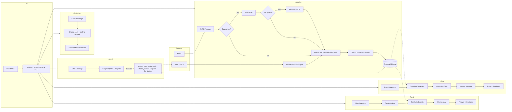

# Prep Pal AI — RAG · Quiz · Web Scraping · Tool Calling · Observability

A fully local AI study tool that turns any document or web topic into interactive quizzes. Upload your PDFs, paste a URL, or just name a topic and it scrapes the web — then generates MCQ, True/False, and Short Answer questions, grades your answers with feedback, and explains concepts on demand. Everything runs on your machine via Ollama. No API keys. No cloud costs.

The primary interface is a **React** single-page app with a collapsible navbar and four sections — **Quiz Prep**, **Study Agent**, **Programming Assistant**, and **Regular Chat** — served by a **FastAPI** backend that streams responses token-by-token. The legacy Streamlit UI (which still hosts Multi-Model Analysis and Insights) remains available.

Built on React + FastAPI + LangChain + LangGraph + ChromaDB + Ollama.

---

## Quick Start

### Docker (recommended)

No local Python, Node, Ollama, or model setup required. One command starts everything.

```bash
git clone <repo-url> && cd rag-ai-chat-bot-with-langchain
docker compose up --build
```

On first boot, Docker pulls `qwen2.5:7b` (~4.7 GB) and `nomic-embed-text` (~274 MB) automatically, builds the React SPA, and starts the API. Open [http://localhost:8000](http://localhost:8000) once the models are ready. Subsequent starts are instant — models are cached in a Docker volume.

### Local development

Two processes: the FastAPI backend and the Vite dev server (which proxies `/api` to the backend).

```bash
# 0. Install Ollama and pull the required models
brew install ollama && brew services start ollama   # macOS
# curl -fsSL https://ollama.com/install.sh | sh    # Linux
ollama pull qwen2.5:7b        # chat, quiz, code, agent
ollama pull nomic-embed-text  # required for all RAG operations

# 1. Backend
git clone <repo-url> && cd rag-ai-chat-bot-with-langchain
python -m venv .venv && source .venv/bin/activate
pip install -r requirements.txt
uvicorn app.api:app --reload          # http://localhost:8000  (API + /docs)

# 2. Frontend (separate terminal)
cd frontend
npm install
npm run dev                           # http://localhost:5173  (proxies /api → :8000)
```

For a production-style local run, build the SPA once (`cd frontend && npm run build`) and the
backend serves it directly at [http://localhost:8000](http://localhost:8000) — no Vite needed.

Optional OCR for scanned PDFs: `brew install tesseract poppler` (macOS) or
`sudo apt install tesseract-ocr poppler-utils` (Debian/Ubuntu).

The legacy Streamlit UI is still runnable with `streamlit run app/ui.py` (port 8501).

---

## Table of Contents

- [Features](#features)
- [Architecture](#architecture)
- [Project Structure](#project-structure)
- [Prerequisites](#prerequisites)
- [Setup](#setup)
  - [Docker setup](#docker-setup)
  - [Local setup](#local-setup)
- [Usage](#usage)
  - [Sidebar: Knowledge Base](#sidebar-knowledge-base)
  - [Chat Tab](#chat-tab)
  - [Quiz Prep Tab](#quiz-prep-tab)
  - [Study Agent Tab](#study-agent-tab)
  - [Multi-Model Analysis Tab](#multi-model-analysis-tab)
  - [Insights Tab](#insights-tab)
  - [CLI Tools](#cli-tools)
  - [Docker](#docker)
- [Supported Models](#supported-models)
- [PDF Ingestion Pipeline](#pdf-ingestion-pipeline)
- [Web Scraping](#web-scraping)
- [Tool Calling Agent](#tool-calling-agent)
- [Orchestration Modes](#orchestration-modes)
- [Configuration Reference](#configuration-reference)
- [Tuning Retrieval Quality](#tuning-retrieval-quality)
- [Performance](#performance)
- [Monitoring & Observability](#monitoring--observability)
- [Testing](#testing)
- [Roadmap](#roadmap)

---

## Features

### Exam & Interview Preparation

- Generate MCQ, True/False, Short Answer, or Mixed questions from any uploaded document or web topic
- Interactive quiz sessions with progress tracking, per-answer feedback, explanations, and a final score breakdown
- Weak-area detection — results screen highlights which topics to review
- Supports any exam type: general exams, technical interviews, job interviews, certifications

### Knowledge Base

- Upload PDFs (including scanned/image-based documents via OCR) — ingested directly in the browser
- Scrape any topic from the web via DuckDuckGo search with Wikipedia fallback — no API key needed
- Persistent ChromaDB vector store with deterministic deduplication (re-ingest the same file safely)

### Study Agent

- Conversational LangGraph agent with 5 tools: search web, generate quiz, grade answer, explain concept, list topics
- Conversation memory persists within a session — ask follow-up questions naturally
- Works with any Ollama model that supports tool calling (`qwen2.5:7b`, `llama3.1:8b`)

### RAG Chatbot

- Document Q&A with source citations (filename + page)
- History-aware retrieval — follow-up questions are rewritten automatically
- Retry any answer with a different model in one click

### Multi-Model Analysis

- Run a question across multiple models in parallel and compare results side-by-side
- Quality scoring (response structure, length, specificity) ranks models automatically
- One-click insight extraction: executive summary, key metrics, risk analysis, recommendations

### Fully Local

- Ollama for LLM inference and embeddings — any supported open-source model
- ChromaDB for persistent vector storage — no account needed
- Zero data leaves your machine

---

## Architecture


```mermaid
flowchart LR
    subgraph Sources
        PDF[PDFs]
        Web[Web / URLs]
    end

    subgraph Ingestion
        PDF --> Stage1[PyPDFLoader]
        Stage1 --> OCR{Sparse text?}
        OCR -- No --> Chunker
        OCR -- Yes --> Stage2[PyMuPDF]
        Stage2 --> OCR2{Still sparse?}
        OCR2 -- No --> Chunker
        OCR2 -- Yes --> Stage3[Tesseract OCR]
        Web --> Scraper[BeautifulSoup Scraper]
        Scraper --> Chunker[RecursiveCharacterTextSplitter]
        Stage3 --> Chunker
        Chunker --> Embedder[Ollama nomic-embed-text]
        Embedder --> ChromaDB[(ChromaDB Local)]
    end

    subgraph RAG
        Question[User Question] --> Ctx[Contextualize]
        Ctx --> Retriever[Similarity Search]
        ChromaDB -.-> Retriever
        Retriever --> LLM[Ollama LLM]
        LLM --> Answer[Answer + Citations]
    end

    subgraph Quiz
        Topic[Topic / Question] --> QuizGen[Question Generator]
        ChromaDB -.-> QuizGen
        QuizGen --> QA[Interactive Q&A]
        QA --> Validator[Answer Validator]
        Validator --> Feedback[Score + Feedback]
    end

    subgraph Agent
        Chat[Chat Message] --> ReAct[LangGraph ReAct Agent]
        ReAct -- tool call --> Tools[search_web · make_quiz · check_answer · explain · list_topics]
        Tools -.-> ChromaDB
        Tools -.-> Web
    end

    subgraph CodeChat
        CodeMsg[Code message] --> CodeLLM[Ollama LLM + coding prompt]
        CodeLLM --> CodeOut[Streamed code answer]
    end

    subgraph UI
        React[React SPA] --> FastAPI[FastAPI :8000 · JSON + SSE]
    end

    FastAPI --> RAG
    FastAPI --> Quiz
    FastAPI --> Agent
    FastAPI --> CodeChat
    FastAPI --> Ingestion
```

---

## Project Structure

```text
rag-ai-chat-bot-with-langchain/
├── app/
│   ├── config.py          # Settings (pydantic-settings), SUPPORTED_MODELS list
│   ├── ingestion.py       # 3-stage PDF pipeline: PyPDF → PyMuPDF → Tesseract OCR
│   ├── embeddings.py      # Ollama nomic-embed-text wrapper (cached singleton)
│   ├── vectorstore.py     # ChromaDB client, batched upsert, deduplication
│   ├── retriever.py       # Similarity retriever with configurable top-K
│   ├── memory.py          # Windowed chat history + LangGraph MemorySaver
│   ├── prompts.py         # Shared prompt templates (contextualize + QA)
│   ├── chain.py           # LangChain LCEL RAG chain (+ streaming)
│   ├── graph.py           # LangGraph stateful RAG graph (+ streaming)
│   ├── analysis.py        # Multi-model parallel analysis + insight generation
│   ├── quiz.py            # Question generation, answer validation, concept explanation
│   ├── scraper.py         # DuckDuckGo search + BeautifulSoup HTML scraper
│   ├── quiz_agent.py      # LangGraph ReAct agent with 5 tools (+ streaming)
│   ├── code_assistant.py  # Programming Assistant — coding chat, no RAG (+ streaming)
│   ├── api_models.py      # Pydantic request/response models (HTTP contract)
│   ├── api.py             # FastAPI app — JSON + SSE routes, /metrics, serves the SPA
│   ├── metrics.py         # Prometheus metrics (LLM latency, tokens, KB size, Ollama up)
│   └── ui.py              # Legacy Streamlit UI (Analysis + Insights live here)
├── frontend/              # React + Vite + TypeScript SPA
│   ├── src/
│   │   ├── api/           # typed client, SSE stream parser, shared types
│   │   ├── components/    # AppLayout, Sidebar, TopBar, ChatPanel, Markdown, …
│   │   ├── context/       # ModelContext, KnowledgeBaseContext
│   │   ├── hooks/         # useStreamingChat, useMediaQuery
│   │   ├── sections/      # QuizPrep, StudyAgent, ProgrammingAssistant, RegularChat
│   │   ├── styles/        # theme.css (design tokens), global.css
│   │   └── __tests__/     # Vitest + React Testing Library
│   ├── package.json
│   └── vite.config.ts
├── scripts/
│   ├── ingest_pdfs.py     # CLI: bulk PDF ingestion
│   └── query_cli.py       # CLI: headless question answering
├── tests/                 # Backend gate tests (deterministic, mocked)
│   ├── test_ingestion.py  test_retriever.py  test_chain.py  test_graph.py
│   ├── test_quiz.py  test_scraper.py  test_quiz_agent.py
│   ├── test_api.py        # FastAPI routes + SSE framing (mocked engine)
│   └── test_code_assistant.py  # Programming Assistant (mocked Ollama)
├── evals/                 # Paid LLM evals (real Ollama, @pytest.mark.eval)
│   ├── conftest.py        # skips when Ollama/models unavailable
│   ├── test_quiz_eval.py
│   └── test_code_assistant_eval.py
├── data/                  # pdfs/ (CLI ingestion) + chroma/ storage (gitignored)
├── requirements.txt
├── Dockerfile             # Multi-stage: builds SPA, serves it via FastAPI
├── monitoring/            # Observability stack (opt-in)
│   ├── prometheus.yml     # scrapes web:8000/metrics
│   ├── loki-config.yml    promtail-config.yml
│   └── grafana/           # provisioned datasources + overview dashboard
├── Dockerfile.streamlit   # Legacy Streamlit image
├── docker-compose.yml     # ollama + ollama-init + web (FastAPI :8000)
└── docker-compose.monitoring.yml  # Prometheus + Grafana + Loki + Promtail
```

---

## Prerequisites

### Docker path

| Requirement | Notes |
| --- | --- |
| [Docker Desktop](https://www.docker.com/products/docker-desktop/) or Docker + Compose plugin | v2.2+ for `service_completed_successfully` condition |

That's it. Ollama, Python, and all models are managed inside containers.

### Local path

| Requirement | Notes |
| --- | --- |
| Python 3.11+ | |
| [Ollama](https://ollama.com/) | Must be running before launching the app |
| `nomic-embed-text` model | Required for all RAG and quiz operations |
| Tesseract + Poppler | Optional — only needed for scanned/image PDFs |

---

## Setup

### Docker setup

```bash
git clone <repo-url>
cd rag-ai-chat-bot-with-langchain
docker compose up --build
```

**What happens on first boot:**

1. `ollama` container starts and passes its healthcheck
2. `ollama-init` pulls `qwen2.5:7b` and `nomic-embed-text` — this takes a few minutes on a fast connection
3. `web` container builds the React SPA and starts the FastAPI server once both models are ready

Open [http://localhost:8000](http://localhost:8000).

**Subsequent starts** skip the model download (volume is cached) and the app is up in seconds.

**Storage:** models live in the `ollama_models` Docker volume. ChromaDB and uploaded PDFs live in the `chroma_data` volume and `./data/pdfs/`. Data persists across `docker compose down` / `docker compose up` cycles.

```bash
# Stop the stack
docker compose down

# Stop and wipe ALL data (models + vectors)
docker compose down -v

# See how much space the model volume uses
docker volume inspect rag-ai-chat-bot-with-langchain_ollama_models

# Run backend tests inside the web container
docker compose exec web python -m pytest tests/ -v

# Ingest PDFs from the data/pdfs/ directory
docker compose exec web python -m scripts.ingest_pdfs
```

**GPU (NVIDIA):** uncomment the `deploy` block in the `ollama` service in `docker-compose.yml`.

---

### Local setup

#### 1. Install Ollama

```bash
# macOS
brew install ollama
brew services start ollama

# Linux
curl -fsSL https://ollama.com/install.sh | sh
ollama serve &   # or use systemd — see ollama.com/docs
```

#### 2. Pull models

```bash
# Required
ollama pull nomic-embed-text   # embeddings (~274 MB)

# Recommended for quiz generation (best structured JSON output)
ollama pull qwen2.5:7b         # ~4.7 GB

# Recommended for tool-calling agent
ollama pull llama3.1:8b        # ~4.7 GB

# Lighter alternatives
ollama pull llama3.2:3b        # ~2 GB — good balance
ollama pull llama3.2:1b        # ~700 MB — fastest, lowest quality
```

You can also pull models directly from the app sidebar.

#### 3. Clone and install

```bash
git clone <repo-url>
cd rag-ai-chat-bot-with-langchain

python -m venv .venv
source .venv/bin/activate        # macOS/Linux
# .venv\Scripts\activate         # Windows

pip install -r requirements.txt
```

#### 4. (Optional) OCR for scanned PDFs

```bash
# macOS
brew install tesseract poppler

# Ubuntu/Debian
sudo apt install tesseract-ocr poppler-utils
```

#### 5. Environment variables

```bash
cp .env.example .env
```

All variables have sensible defaults. The app works out of the box without editing `.env`. See [Configuration Reference](#configuration-reference) for the full list.

---

## Usage

### Web UI (React)

The React app (default, [http://localhost:8000](http://localhost:8000)) has a **collapsible left navbar** with four sections and a **top bar** holding the model picker, Ollama status, and a **Knowledge base** button. Each section has its own accent color, so the UI shifts hue as you move between them. The sidebar collapses to an icon rail on desktop and becomes a drawer on mobile.

The **Knowledge base** button opens a panel that lists every indexed file/URL with its chunk count, lets you upload PDFs or scrape a web topic, and shows a clear ✓/✗ acknowledgement when indexing finishes (with a live "indexing…" indicator). All dropdowns (model, quiz options) are custom, theme-matched, keyboard-accessible components — not native browser selects.

| Section | What it does |
| --- | --- |
| **Quiz Prep** | Configure a quiz (topic, type, count, difficulty, exam type), then take it question-by-question with instant grading, explanations, and a final score breakdown. |
| **Study Agent** | A tool-calling LangGraph tutor that can search the web, build the knowledge base, quiz you, grade answers, and explain — streamed, with tool-use chips. |
| **Programming Assistant** | A coding chat (no document grounding) with syntax-highlighted, copy-able code blocks. |
| **Regular Chat** | RAG document Q&A with source citations and a LangChain/LangGraph mode toggle. |

All chat responses stream token-by-token over SSE. Upload a PDF or scrape a topic from the top bar before using Quiz Prep or Regular Chat.

---

> The sections below document the **legacy Streamlit UI** (`streamlit run app/ui.py`, port 8501), which additionally hosts Multi-Model Analysis and Insights. The React UI mirrors Quiz Prep, Study Agent, and Regular Chat, and adds the Programming Assistant.

### Sidebar: Knowledge Base

The sidebar is the primary way to load content before using any tab.

| Control | What it does |
| --- | --- |
| **Ollama status** | Live connection indicator — green dot means Ollama is running |
| **Chat model** | Select the LLM used for chat, analysis, and insights |
| **Pull button** | Downloads a model from Ollama if not yet installed |
| **Mode** | Switch between LangChain and LangGraph orchestration |
| **Retrieved chunks (Top-K)** | How many document chunks to retrieve per query |
| **PDFs → Upload & Index** | Upload PDFs — processed through 3-stage pipeline immediately |
| **Scrape Web** | Type a topic → DuckDuckGo search → scrape + index top pages |
| **Clear KB** | Delete all vectors from ChromaDB |
| **Clear Chat** | Reset the current conversation history |

**Tip:** Load content first before using Quiz Prep or Study Agent. Either upload a PDF or use Scrape Web.

---

### Chat Tab

Standard RAG Q&A against your knowledge base.

1. Upload PDFs or scrape a topic via the sidebar
2. Type any question in the chat input
3. Receive a grounded answer with source citations (filename + page)
4. **Retry bar** — after any response, retry the same question with a different model in one click

Suggested questions appear when the chat is empty to get you started.

---

### Quiz Prep Tab

Interactive quiz sessions driven by your knowledge base.

**Setup:**

| Field | Options |
| --- | --- |
| Topic | Free text — e.g. "binary search trees", "Python decorators" |
| Question type | MCQ · True/False · Short Answer · Mixed |
| Questions | 5 / 10 / 15 / 20 |
| Difficulty | Easy · Medium · Hard · Mixed |
| Exam type | General exam · Technical interview · Job interview · Certification · University exam |
| Generation model | Any installed Ollama model (`qwen2.5:7b` recommended) |

Click **Generate Quiz**. If the knowledge base is empty, the sidebar shows a warning — upload a PDF or use **Scrape Web** first.

**During the quiz:**

- MCQ: radio buttons for A/B/C/D options
- True/False: radio buttons for True/False
- Short Answer: text area
- Submit → instant feedback with score, explanation, and what you missed

**Results screen:**

- Final score (X/Y and percentage)
- Per-question breakdown (correct/incorrect, your answer vs correct answer)
- Weak areas highlighted with a review recommendation
- **Retake Same Quiz** or **New Quiz** buttons

---

### Study Agent Tab

A conversational LangGraph agent with tool calling. It can search the web, generate quizzes, grade your answers, and explain concepts — all in a single chat thread without switching tabs.

**What you can say:**

```text
"Quiz me on Python async programming"
"Search for System Design interview questions and test me"
"Generate 10 MCQ questions about Big O notation at hard difficulty"
"I answered recursion wrong — explain it to me"
"What topics are in my knowledge base?"
"Search for React hooks and generate a true/false quiz"
```

The agent automatically:

1. Checks whether the topic is in the knowledge base
2. Scrapes the web if content is missing (without you asking)
3. Generates questions and presents them one by one
4. Grades each answer when you respond
5. Summarises your score and weak areas at the end

**Model note:** Tool calling requires a model that supports it. `qwen2.5:7b` and `llama3.1:8b` both work well. `gemma2:9b` and `llama3.2:1b` do not support tool calling.

---

### Multi-Model Analysis Tab

Run one question across multiple models simultaneously and compare results.

1. Select models from the multiselect (defaults to installed models)
2. Enter your analysis question
3. Click **Run** — all models are queried in parallel via `ThreadPoolExecutor`
4. Results sorted by quality score (0–100, based on length, structure, and specificity)
5. Best result auto-expanded and marked with ★

Each result card shows: word count, response time, quality score.

---

### Insights Tab

One-click structured knowledge base analysis.

1. Select a model
2. Click **Generate Insights**

Returns four sections:

- **Executive Summary** — overview of all indexed documents
- **Key Metrics & Data Points** — extracted numbers, dates, percentages
- **Risk Analysis** — risks categorised by severity with mitigations
- **Actionable Recommendations** — prioritised next steps

---

### CLI Tools

```bash
# Ingest PDFs from the default directory (data/pdfs/)
python -m scripts.ingest_pdfs

# Ingest from a custom directory
python -m scripts.ingest_pdfs --pdf-dir /path/to/docs

# Query using LangChain LCEL (default)
python -m scripts.query_cli "What does the document say about recursion?"

# Query using LangGraph
python -m scripts.query_cli "Explain binary search" --mode graph

# Override model and top-K
python -m scripts.query_cli "Summarize chapter 3" --model mistral --top-k 8

# Multi-turn conversation via session ID
python -m scripts.query_cli "What is a binary tree?" --session-id session1
python -m scripts.query_cli "How does it differ from a BST?" --session-id session1
```

---

### Docker

See [Docker setup](#docker-setup) for the full walkthrough.

```bash
# Start the full stack (Ollama + model init + React/FastAPI web)
docker compose up --build

# Common operations while the stack is running
docker compose exec web python -m scripts.ingest_pdfs       # ingest PDFs
docker compose exec web python -m pytest tests/ -v          # run tests
docker compose logs -f ollama-init                          # watch model download progress
docker compose logs -f web                                  # stream web/API logs

# Stop without losing data
docker compose down

# Full reset — removes volumes (models + vectors)
docker compose down -v
```

---

## Supported Models

| Model | Size | Pull command | Notes |
| --- | --- | --- | --- |
| `qwen2.5:7b` | ~4.7 GB | `ollama pull qwen2.5:7b` | **Default** · Best structured JSON output · Recommended for quiz generation |
| `llama3.1:8b` | ~4.7 GB | `ollama pull llama3.1:8b` | Strong reasoning · Best for Study Agent tool calling |
| `mistral` | ~4.1 GB | `ollama pull mistral` | Good all-rounder |
| `gemma2:9b` | ~5.4 GB | `ollama pull gemma2:9b` | Google model · Quality responses · No tool calling |
| `deepseek-r1:7b` | ~4.7 GB | `ollama pull deepseek-r1:7b` | Strong reasoning (R1 distil) |
| `llama3.2:3b` | ~2 GB | `ollama pull llama3.2:3b` | Lightweight balance |
| `llama3.2:1b` | ~700 MB | `ollama pull llama3.2:1b` | Fastest · Lowest memory · No tool calling |

The `nomic-embed-text` embedding model (`ollama pull nomic-embed-text`) is required regardless of which chat model you use.

All models can be pulled from the app sidebar. Models that don't support tool calling will work for Chat, Quiz Prep, and Analysis tabs but not the Study Agent.

---

## PDF Ingestion Pipeline

`app/ingestion.py` runs a 3-stage extraction pipeline:

1. **PyPDFLoader** (stage 1) — Fast, standard text extraction. Works for digitally created PDFs.
2. **PyMuPDF** (stage 2) — Better layout handling. Triggered automatically when stage 1 yields fewer than 80 characters per page on average.
3. **Tesseract OCR** (stage 3) — Full OCR via `pdf2image` + `pytesseract`. Triggered automatically when stage 2 is still sparse. Requires Tesseract to be installed (see [Setup](#setup)).

After extraction:

- `RecursiveCharacterTextSplitter` chunks text using `["\n\n", "\n", " "]` separators
- Each chunk gets metadata: `source`, `page`, `chunk_index`
- Vector ID = `SHA256(filename::page::chunk_index)` — re-ingesting the same file overwrites, never duplicates
- Chunks are embedded with `nomic-embed-text` and stored in ChromaDB in batches of 100

---

## Web Scraping

`app/scraper.py` builds a knowledge base from web sources when you don't have documents:

**How it works:**

1. `search_and_scrape(topic)` queries DuckDuckGo for the topic (no API key needed)
2. Top results are fetched with `httpx`
3. `BeautifulSoup` extracts readable content (strips nav, footers, scripts, ads)
4. Text is chunked and ingested into ChromaDB with the same pipeline as PDFs
5. If DuckDuckGo fails, falls back to a direct Wikipedia URL for the topic

**Where to use it:**

- **Sidebar → Scrape Web**: type a topic and click Search & Index
- **Study Agent**: say "search for [topic]" — the agent calls the tool automatically

Scraped chunks have `type: "web"` in metadata and display the source URL in the Quiz Prep question source field.

---

## Tool Calling Agent

`app/quiz_agent.py` implements a LangGraph `create_react_agent` with five tools:

| Tool | What it does |
| --- | --- |
| `search_and_add_to_kb` | DuckDuckGo search → scrape → ingest into ChromaDB |
| `make_quiz` | Generate N questions on a topic from the knowledge base |
| `check_answer` | Grade a student answer with score, feedback, and hints |
| `explain` | Detailed concept explanation from the knowledge base |
| `list_topics` | Summarise what's in the current knowledge base |

A module-level `MemorySaver` checkpointer keeps conversation history across Streamlit reruns for the lifetime of the process. Each "New Session" click assigns a new `thread_id`, effectively starting a fresh conversation.

The agent rebuilds the LLM client on each call (allowing model switching mid-session) while reusing the same checkpointer so history is preserved.

---

## Orchestration Modes

The Chat tab offers two RAG orchestration modes, switchable at runtime:

### LangChain LCEL (`app/chain.py`)

- `create_history_aware_retriever` — rewrites follow-up questions to be standalone
- `create_stuff_documents_chain` — stuffs retrieved docs into the QA prompt
- `create_retrieval_chain` — composes retrieval + generation
- Memory: windowed in-memory buffer keyed by session ID

### LangGraph (`app/graph.py`)

Three-node `StateGraph`: `contextualize → retrieve → generate`

- **contextualize**: rewrites the question if there is prior history
- **retrieve**: cosine similarity search against ChromaDB
- **generate**: produces the answer with citations
- Compiled with `MemorySaver` checkpointer — state persists per `thread_id`

Both modes use the same prompts from `app/prompts.py` and return:

```python
{"answer": str, "sources": [{"source": str, "page": int}]}
```

---

## Configuration Reference

All settings are managed by `pydantic-settings` in `app/config.py`. Override any value in `.env` or as an environment variable.

| Variable | Default | Description |
| --- | --- | --- |
| `OLLAMA_BASE_URL` | `http://localhost:11434` | Ollama server URL |
| `OLLAMA_MODEL` | `qwen2.5:7b` | Default LLM for chat, quiz, and analysis |
| `OLLAMA_EMBEDDING_MODEL` | `nomic-embed-text` | Embedding model (required) |
| `OLLAMA_KEEP_ALIVE` | `30m` | How long Ollama keeps the model resident after a call. Higher = no cold-load latency between requests. `-1` keeps it loaded indefinitely. |
| `CHROMA_PERSIST_DIR` | `data/chroma` | ChromaDB persistent storage directory |
| `CHROMA_COLLECTION_NAME` | `rag-chatbot` | ChromaDB collection name |
| `CHUNK_SIZE` | `1000` | Max characters per text chunk |
| `CHUNK_OVERLAP` | `200` | Character overlap between chunks |
| `TOP_K` | `5` | Documents retrieved per query |
| `MEMORY_WINDOW` | `10` | Conversation turns (Q+A pairs) kept in memory |
| `QUIZ_DEFAULT_N` | `10` | Default number of quiz questions |
| `QUIZ_TOP_K` | `8` | Chunks retrieved for question generation |

After changing `CHUNK_SIZE` or `CHUNK_OVERLAP`, re-ingest documents for the change to take effect. All other settings apply on the next request.

---

## Tuning Retrieval Quality

| Parameter | Effect |
| --- | --- |
| `TOP_K` | Higher = more context but more tokens. Start at 5, increase if answers are incomplete. |
| `CHUNK_SIZE` | Larger chunks give more context per result; smaller chunks give more precise matches. |
| `CHUNK_OVERLAP` | Increase if answers are being cut off at chunk boundaries. |
| `QUIZ_TOP_K` | Higher = more source material for question generation. Increase if questions are too narrow. |
| Model choice | Larger models (`llama3.1:8b`, `qwen2.5:7b`) produce better questions and answers than smaller ones. |

---

## Performance

First-token latency is dominated by the local model. Two levers:

- **Keep the model warm.** `OLLAMA_KEEP_ALIVE` (default `30m`) keeps the model resident between requests, so you only pay the multi-second cold load once. Set `-1` to never unload. This is applied to every LLM call.
- **Pick a model that fits your hardware.** `qwen2.5:7b` is the quality default; on slower machines switch to `llama3.2:3b` (≈2 GB) or `llama3.2:1b` from the model picker for noticeably faster responses at lower quality.

All chat surfaces stream token-by-token, so the first token appears as soon as the model starts generating rather than after the full answer. Quiz generation is a single non-streaming call (it returns N structured questions at once) and is the slowest operation — use a smaller model or fewer questions if it drags. Watch the actual numbers on the latency panels in Grafana (below).

---

## Monitoring & Observability

The backend exposes Prometheus metrics at **`GET /metrics`**. A ready-made stack (Prometheus + Grafana + Loki + Promtail) lives in `monitoring/` and ships logs and metrics straight to a provisioned Grafana dashboard.

```bash
# Launch the app + observability stack together
docker compose -f docker-compose.yml -f docker-compose.monitoring.yml up --build
```

| Service | URL | Purpose |
| --- | --- | --- |
| Grafana | [http://localhost:3000](http://localhost:3000) (admin / admin) | Dashboards + log explorer |
| Prometheus | [http://localhost:9090](http://localhost:9090) | Metrics store, scrapes `web:8000/metrics` |
| Loki | `http://localhost:3100` | Log store (queried via Grafana) |
| `/metrics` | [http://localhost:8000/metrics](http://localhost:8000/metrics) | Raw Prometheus exposition |

Grafana opens with the **"Prep Pal AI — Overview"** dashboard already provisioned (datasources + panels), showing:

- Ollama up/down, indexed KB chunks, request and error rates
- LLM request latency **p95 by surface** (chat · code · agent · quiz)
- Streamed **tokens/sec by surface** and HTTP request rate by route
- A live **log panel** (Loki) filtered to the `web` service — `{compose_service="web"}`

### Custom metrics

| Metric | Type | Labels | Meaning |
| --- | --- | --- | --- |
| `preppal_llm_request_duration_seconds` | histogram | `surface` | End-to-end LLM request duration |
| `preppal_llm_requests_total` | counter | `surface`, `status` | LLM requests by outcome |
| `preppal_stream_tokens_total` | counter | `surface` | Tokens streamed to clients |
| `preppal_ollama_up` | gauge | — | Ollama reachable (1/0) |
| `preppal_kb_chunks` | gauge | — | Chunks indexed in the knowledge base |

Default per-route HTTP metrics (`http_requests_total`, `http_request_duration_seconds`) come from `prometheus-fastapi-instrumentator`.

### Streaming logs

Logs are written to stdout (captured by Docker). Stream them directly:

```bash
docker compose logs -f web          # app/API logs
docker compose logs -f ollama       # model server
```

Or explore them in Grafana → Explore → Loki with `{compose_service="web"}` (Promtail tails all project containers via the Docker socket). To wire your own stack, point any Prometheus scraper at `web:8000/metrics`.

---

## Testing

Two lanes: **gate tests** (deterministic, mocked, no Ollama/network) run on every change;
**evals** (paid, real Ollama) run before ship.

```bash
# Backend gate tests — deterministic, no Ollama
pytest tests/ -v

# Frontend gate tests — Vitest + React Testing Library
cd frontend && npm run test

# Evals — require a running Ollama with qwen2.5:7b + nomic-embed-text pulled.
# Skip cleanly (not fail) when models are unavailable.
pytest evals/ -m eval -v
```

### Backend gate tests (`tests/`)

| Test file | What is covered |
| --- | --- |
| `test_ingestion.py` | Chunk ID determinism, PDF loading + metadata, empty directory |
| `test_retriever.py` | Default and custom top-K configuration |
| `test_chain.py` | LCEL chain invoke, source extraction, empty context |
| `test_graph.py` | Node-level: contextualize (with/without history), retrieve, generate |
| `test_quiz.py` | JSON extraction, MCQ/TF deterministic grading, short-answer LLM grading, generation, error handling |
| `test_scraper.py` | HTML extraction, script/nav stripping, URL scraping, HTTP errors, DDG search, Wikipedia fallback |
| `test_quiz_agent.py` | All 5 tool wrappers, empty KB, errors, n-clamping, delegation |
| `test_api.py` | FastAPI routes, validation errors, KB upload/scrape, SSE event framing + ordering (mocked engine) |
| `test_code_assistant.py` | Coding system prompt, per-thread memory, thread isolation, streaming, error handling |

### Frontend gate tests (`frontend/src/__tests__/`)

| Test file | What is covered |
| --- | --- |
| `stream.test.ts` | SSE frame parsing, partial-frame buffering, streaming POST event order, error path |
| `client.test.ts` | Typed fetch wrapper: JSON serialization, multipart upload, `ApiError` mapping |
| `quizReducer.test.ts` | Quiz state machine transitions (setup → question → feedback → results), scoring |
| `useStreamingChat.test.tsx` | Token accumulation, sources attach, error flag, ignore-while-streaming |
| `Sidebar.test.tsx` | Sections render, `aria-current` active item, collapse callback, rail labels, mobile-drawer Esc |
| `ChatPanel.test.tsx` | Empty state, message render, submit/Enter send + clear, Stop while streaming |

### Evals (`evals/`)

| Eval file | Threshold |
| --- | --- |
| `test_quiz_eval.py` | ≥60% of generated MCQs are well-formed; a known-correct answer grades 100 |
| `test_code_assistant_eval.py` | Response is non-empty, contains a fenced code block, and retains conversation memory |

---

## Roadmap

- [x] Streaming responses (token-by-token output) — shipped via SSE
- [ ] Spaced repetition — resurface questions you answered wrong on a schedule
- [ ] Question bank export (JSON / CSV / Anki format)
- [ ] Support for DOCX, TXT, HTML, EPUB ingestion
- [ ] Metadata filtering (filter retrieval by source, date)
- [ ] Hybrid search (keyword + semantic)
- [ ] FastAPI endpoint for headless/programmatic quiz generation
- [ ] RAGAS evaluation for measuring RAG answer quality
- [ ] Authentication and per-user knowledge bases

---

## License

MIT
